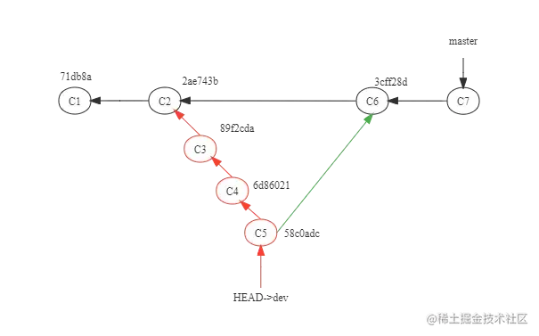
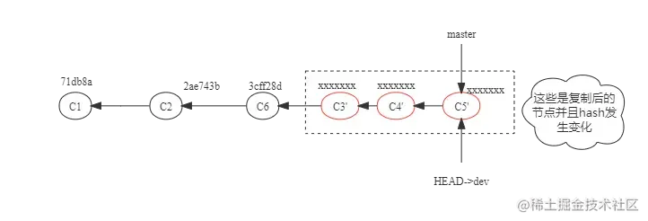

# git rebease 还是git merge
主要体现在合并代码的时候

## git merge

- 找到master和dev的共同祖先，即C2
- 将dev的最新提交C5和master的最新提交即C6合并成一个新的提交C7，有冲突的话，解决冲突
- 将C2之后的dev和master所有提交点，按照提交时间合并到master

## git rebease

执行git rebase master，有冲突就解决冲突，解决后直接git add . 再git rebase --continue即可

发现采用rebase的方式进行分支合并，整个master分支并没有多出一个新的commit，原来dev分支上的那几次（C3，C4，C5）commit记录在rebase之后其hash值发生了变化，不在是当初在dev分支上提交的时候的hash值了，但是提交的内容被全部复制保留了，并且整个master分支的commit记录呈线性记录

## 总结
使用rebase操作的最大好处在于你可以让项目提交历史变得非常干净整洁。缺点也比较明显，由于rebase原理是撤销之前的提交，然后把分支上的提交重新提交新的节点

如果你想要一个干净的，没有merge commit的线性历史树，那么你应该选择git rebase

如果你想保留完整的历史记录，并且想要避免重写commit history的风险，你应该选择使用git merge

我建议使用git merge