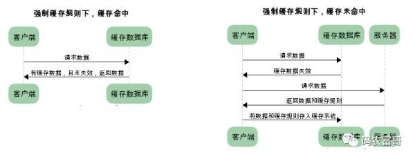
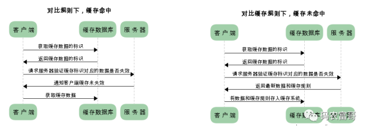

# http缓存机制

## 什么是http缓存

http缓存是http性能优化中简单高效的一种优化方式了，缓存是一种保证资源副本在下一次请求时直接使用该副本的技术，当浏览器发现请求的资源副本还存在就会直接返回资源的拷贝，不再去源服务器下载

## 缓存策略

用户访问网页的方式主要有以下3种

- url输入链接或则使用书签
- 用户f5刷新，地址栏中刷新，或则右键刷新等
- 用户ctrl+f5强制刷新

不同的刷新手段使用的是不同的缓存策略

http的缓存类型有很多，根据是否需要像服务器发送请求，主要可以分成两大类，强缓存和协商缓存

首先要明白，这两种缓存策略是相辅相承的，不是说浏览器一定要走单独的某一个缓存机制

## 强缓存

其实只有前半部分属于强缓存，在确认缓存数据未失效的情况下直接使用缓存数据，那么我们如何判断缓存数据未失效呢

对于强缓存来说，响应header中有两个字段标识，Expires， Cache-Control

- Expires 这个是http1.0的产物，现在默认浏览器都是http1.1了，所以这个字段基本可以忽略，只是有些浏览器对这个字段做了兼容。它的值返回的是服务器返回的过期时间，下一次请求时如果访问时间小于服务器返回的过期时间就直接使用缓存，这里有个问题，如果系统时间和服务器时间不准，就会造成缓存读取异常

- Cache-Control，在http1.1中都使用这个来取代了Expires，主要取值有以下几种
  - max-age 用来设置资源可以被缓存的时间，单位是秒
  - s-maxage 这个和max-age一样，主要针对服务器资源（这个不太了解）
  - public 指示响应可被任何缓存区缓存
  - private 只能针对个人用户，不能对代理服务器缓存
  - no-cache 强制客户端直接向服务器发送请求，服务器接收到请求后再来判断资源是否修改，如果修改返回新的资源，如果未修改返回304，浏览器使用缓存
  - no-store 这个指的是浏览器不缓存

## 协商缓存

如果强缓存（浏览器缓存）没命中，这个时候就会走协商缓存，其实就是上面的no-cache的方式，这是对强缓存的补充

协商缓存中有两个字段来标识

- Last-Modified/If-Modified-Since

    服务器在响应请求时会告诉浏览器资源最后修改时间Last-Modified，当浏览器再次请求资源时会加上If-Modified-Since字段，这个字段存储的是上一次返回Last-Modified，服务器会拿资源修改时间和If-Modified-Since做比较，如果大于就会返回最新的数据，反之就会返回304，让浏览器使用缓存

- Etag  /  If-None-Match（优先级高于前一个）

    其实和上面的差不多，第一次请求时，服务器返回一个Etag唯一标识，第二次请求的时候加入If-Modified-Since这个字段，值就是Etag的值，服务器接收后会和自己的唯一标识做对比，如果一致就会返回304，反之返回最新的数据

最后会把协商缓存返回的数据存起来

## 总结

