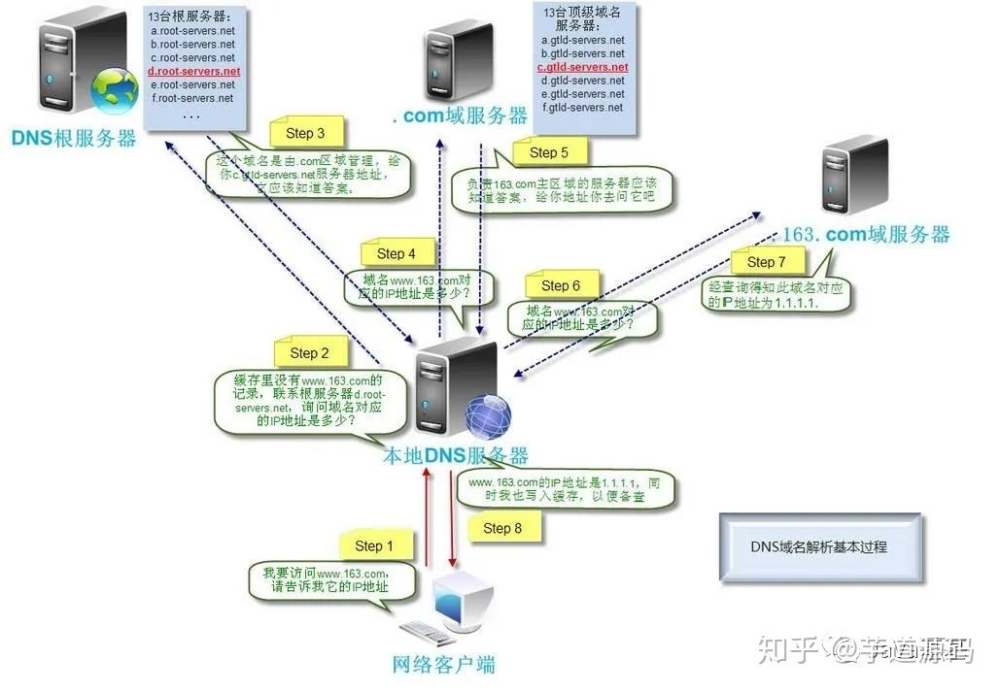
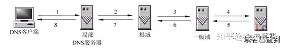
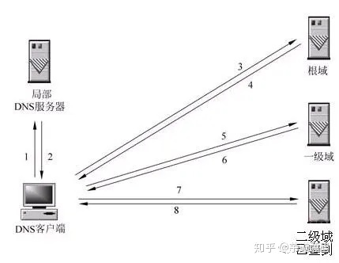
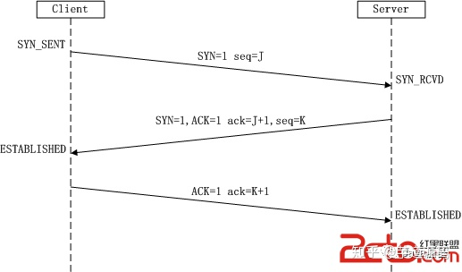
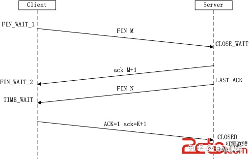
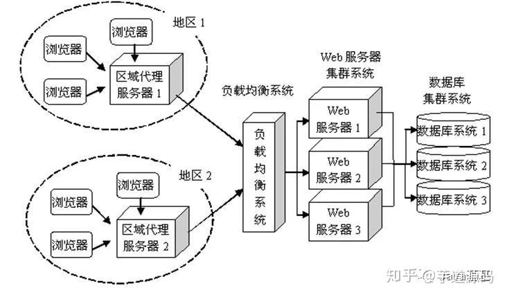
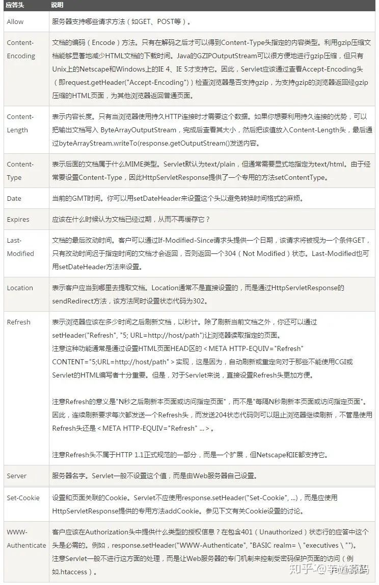

## 从输入URL到页面展现

最常见回答
- 1、输入地址
- 2、浏览器根据域名查找ip地址
- 3、浏览器像web服务器发送一个http请求
- 4、服务器的永久重定向响应
- 5、服务器处理请求
- 6、服务器返回一个http响应
- 7、浏览器显示html
- 8、浏览器发送请求获取js，css，图片资源等文件

上面的回答就很浅显了，往深处问肯定会挂掉

总体过程大概如下

### 1、输入地址
这个就没啥可说的了，纯用户操作，比如我们输入的链接是https://www.163.com

### 2、浏览器根据域名查询ip
首先我们拿https://www.baidu.com为例可以看到，这个域名分三级，所以我们要了解几个概念，根服务器，.com域服务器，.baidu.com域服务器

- 1、客户端请求一旦发起，浏览器首先要做的事情就是解析这个域名，一般来说，浏览器会查看本地硬盘的hosts文件，看看其中有没有配置响应的域名对应规则，如果有的话就可以直接使用hosts中的配置，基于这点我们在调试的时候可以使用fiddler，whistle等代理工具
- 2、如果在本地的hosts文件中没有找到对应的ip地址，浏览器就会发送一个DNS请求到本地DNS服务器，本地的DNS服务器一般由网络接入的运营商提供，比如中国电信，中国移动
- 3、查询你输入的网址的DNS请求到本地服务器后，DNS本地服务器首先查询缓存中是否有网址记录，如果有的话直接输出，没有的话就继续向DNS根服务器发送查询消息
- 4、根DNS服务器上是没有记录网址和域名关系的，它存储了域服务器的地址，他会告诉本地DNS服务器，你可以到.com域服务器上查询
- 5、本地DNS服务器像.com域服务器上发送请求，.com服务器上也没有存储具体的链接和ip的对应关系，它存储了以.com为一级域名的二级域名的地址列表，然后会查询出.163.com的地址返回给本地DNS服务器
- 6、本地DNS服务器像.163.com发送请求，这个时候在这台服务器上就能查到具体的链接和ip的映射了，然后返回给本地DNS服务器
- 7、本地DNS服务器显示把这个链接和ip的映射存储一下，然后再把ip返回给客户端

下面这个图可以描述的很清楚了


### 扩展知识
#### 1、什么是DNS？
DNS(Domain Name System)，域名系统，在英特网上作为域名和ip相互转换的分布式数据库，其实简单理解就是给ip主机取一个别名，别名是利于我们自然人记住，而ip是一串数字便于计算机使用，通过主机名，最终得到该主机名对应的IP地址的过程叫做域名解析
#### 2、DNS查询的两种方式，递归查询和迭代查询
- 递归查询
  - 本地DNS服务器依次像根DNS服务器，一级域服务器，二级域服务器这样查询，直至返回结果，再依次返回
  
- 迭代解析
  - 当局部DNS服务器自己不能回答客户机的DNS查询时，不是局部DNS服务器去查询，而是把下一跳的DNS服务器的地址返回，由本地DNS服务器再挨个去查询，知道取到最终结果


向我们上面的DNS解析过程，在1,2步就用到了递归解析，后面其他步骤就是迭代解析

### 3、浏览器像web服务器发送一个http请求
浏览器不是立马像服务器发送http请求的，它会先建立tcp链接，tcp链接建立后才会继续发送http请求，

### 扩展知识
#### 1、tcp的3次握手
- 第一次握手 客户端A将标志位SYN置为1,随机产生一个值为seq=J（J的取值范围为=1234567）的数据包到服务器，客户端A进入SYN_SENT状态，等待服务端B确认，客户端进入SYN_SENT
- 第二次握手 服务端B收到数据包后由标志位SYN=1知道客户端A请求建立连接，然后他将标志位ACK，SYN都重置为1，然后ack=J+1，再随机生成一个seq=K，然后把数据包返回给客户端，服务端进入SYN_RCVD
- 第三次握手 客户端收到数据包，先去校验ack是否是J+1，ACK是否是1，如果正确再去构造数据包，此时ack=K+1,ACK=1，服务端收到包后检查ack是否为K+1，ACK是否为1，如果检查通过则建立tcp连接，客户端和服务端都进入ESTABLISHED状态，此时可以传输数据了


#### 2、为什么建立连接需要3次握手，2次或则4次可以吗
“三次握手”的目的是“为了防止已失效的连接请求报文段突然又传送到了服务端，因而产生错误”

发送数据包的时候有一种异常，“已失效的连接请求报文段”的产生在这样一种情况下，client发出的第一个连接请求报文段并没有丢失，而是在某个网络结点长时间的滞留了，以致延误到连接释放以后的某个时间才到达server。

先解释为什么需要3次握手，如果client发出连接请求后server就回包，上述异常就会造成，一段client请求已经发送接收完毕，此时这个滞留的包才到server端，然后server认为新的连接建立了，client又不会继续发包，server端就一直白等着，这样server的很多资源就白白浪费掉了，3次握手的目的就是为了防止支援浪费

3次握手我们可以理解成一个对话
- client：我请求建立一个连接，我的标识是J，收到请回复
- server：我收到了，你确认一下标识对不对，按照制定的规范+1，然后我的标识是K，给你再发个请求，收到请回复
- client：我收到了，我的标识校验通过了，我没问题准备发送，按照规范把你的标识+1，给你发个请求，收到请校验
- server：我收到了，校验成功，我也准备好接收了

如果是2次对话，server是无法知道client有没有接收到自己消息的

4次的话会照成资源浪费

#### 3、tcp关闭连接，4次挥手
- 第一次挥手： Client发送一个FIN，用来关闭Client到Server的数据传送，Client进入FIN_WAIT_1状态。

- 第二次挥手： Server收到FIN后，发送一个ACK给Client，确认序号为收到序号+1（与- SYN相同，一个FIN占用一个序号），Server进入CLOSE_WAIT状态。

- 第三次挥手： Server发送一个FIN，用来关闭Server到Client的数据传送，Server进入LAST_ACK状态。

- 第四次挥手： Client收到FIN后，Client进入TIME_WAIT状态，接着发送一个ACK给Server，确认序号为收到序号+1，Server进入CLOSED状态，完成四次挥手。



#### 4、为什么3次握手，4次挥手
这是因为服务端在LISTEN状态下，收到建立连接请求的SYN报文后，把ACK和SYN放在一个报文里发送给客户端。关闭的时候当server收到client关闭消息的时候，可能还没接收完包呢，所以会分两次回复
4次挥手对话
- client我发送完了，准备关闭连接吧，校验码是M，收到请回复
- server收到，你确认一下，我收到消息了，但是数据还没接收完
- server数据接收完了，检验码是L
- client收到，我校验通过了，包给你，你校验吧
- server收到校验成功，close掉链接

### 4、服务器的永久重定向响应
为什么服务器一定要重定向而不是直接发送用户想看的网页内容呢，其中一个原因跟搜索引擎排名有关。如果一个页面有两个地址，https://www.baidu.com和https://baidu.com，搜索引擎认为是两个地址，而搜索引擎知道301永久重定向是什么意思，这样就会把访问带www的和不带www的地址归到同一个网站排名下

### 5、浏览器跟踪重定向地址
知道最新的地址之后，就会重新发一个http请求

### 6、服务器处理请求
经过前面的处理，请求已经到服务器了，后端从接收到TCP报文开始，它会对TCP连接进行处理，对HTTP协议进行解析，并按照报文格式进一步封装成HTTP Request对象，供上层使用。

一些大一点的网站，流量很大，一台服务器的话会让访问速度变的很慢，甚至崩溃，所以可以采用nginx，客户端不是直接通过HTTP协议访问某网站应用服务器，而是先请求到Nginx，Nginx再请求应用服务器，然后将结果返回给客户端

如下图


### 7、服务器返回一个 HTTP 响应
当服务器处理完请求之后，会把处理结果返回，也就是返回一个http响应

HTTP响应与HTTP请求相似，HTTP响应也由3个部分构成，分别是：
- 状态行
- 响应头(Response Header)
- 响应正文

一个完整的响应
```js
HTTP/1.1 200 OK
Server: openresty
Date: Fri, 17 Jun 2022 13:25:41 GMT
Content-Type: text/html; charset=utf-8
Transfer-Encoding: chunked
Connection: close
Cache-Control: max-age=30
Expires: Fri, 17 Jun 2022 13:26:11 GMT
L5percent: 100
Access-Control-Allow-Credentials: true
Access-Control-Allow-Methods: GET, POST, OPTIONS
Content-Encoding: gzip

jsonpCBKC({"data":[{"activePayType":1,"ddwSrcPrice":1,"strAwardName":"测试pop08","strHelpHead":"https://img20.360buyimg.com/img/s180x180_jfs/t1/184510/15/7436/6945/60ba0edbE7b664dad/a3fc2dfd52bf1d57.png","strNickName":"GUO**SAO"},{"activePayType":1,"ddwSrcPrice":1,"strAwardName":"天天领红包测试","strHelpHead":"https://img20.360buyimg.com/img/s180x180_jfs/t1/184510/15/7436/6945/60ba0edbE7b664dad/a3fc2dfd52bf1d57.png","strNickName":"GUO**SAO"},{"activePayType":1,"ddwSrcPrice":30,"strAwardName":"私域-gzj3","strHelpHead":"https://img20.360buyimg.com/img/s180x180_jfs/t1/184510/15/7436/6945/60ba0edbE7b664dad/a3fc2dfd52bf1d57.png","strNickName":"jd_**2f5"},{"activePayType":1,"ddwSrcPrice":30,"strAwardName":"私域-gzj3","strHelpHead":"https://img20.360buyimg.com/img/s180x180_jfs/t1/184510/15/7436/6945/60ba0edbE7b664dad/a3fc2dfd52bf1d57.png","strNickName":"GUO**SAO"},{"activePayType":100,"ddwSrcPrice":30,"strAwardName":"私域-gzj2","strHelpHead":"https://img20.360buyimg.com/img/s180x180_jfs/t1/184510/15/7436/6945/60ba0edbE7b664dad/a3fc2dfd52bf1d57.png","strNickName":"GUO**SAO"},{"activePayType":100,"ddwSrcPrice":2200,"strAwardName":"test2","strHelpHead":"https://img20.360buyimg.com/img/s180x180_jfs/t1/184510/15/7436/6945/60ba0edbE7b664dad/a3fc2dfd52bf1d57.png","strNickName":"jd_**2f5"}],"iRet":0,"sErrMsg":""}
)
```

#### 状态行：
状态行由协议版本，数字形式的状态代码，及相应的状态描述，各元素之间以空格分隔。
例如: HTTP/1.1 200 OK

协议版本： 是用http1.0还是其他版本

状态描述： 状态描述给出了关于状态代码的简短的文字描述。比如状态代码为200时的描述为 ok

状态码： 状态代码由三位数字组成

1xx：信息性状态码，表示服务器已接收了客户端请求，客户端可继续发送请求。
- 100 Continue
- 101 Switching Protocols
  
2xx：成功状态码，表示服务器已成功接收到请求并进行处理。
- 200 OK 表示客户端请求成功
- 204 No Content 成功，但不返回任何实体的主体部分
- 206 Partial Content 成功执行了一个范围（Range）请求

3xx：重定向状态码，表示服务器要求客户端重定向。
- 301 Moved Permanently 永久性重定向，响应报文的Location首部应该有该资源的新URL
- 302 Found 临时性重定向，响应报文的Location首部给出的URL用来临时定位资源
- 303 See Other 请求的资源存在着另一个URI，客户端应使用GET方法定向获取请求的资源
- 304 Not Modified 服务器内容没有更新，可以直接读取浏览器缓存
- 307 Temporary Redirect 临时重定向。与302 Found含义一样。302禁止POST变换为GET，但实际使用时并不一定，307则更多浏览器可能会遵循这一标准，但也依赖于浏览器具体实现

4xx：客户端错误状态码，表示客户端的请求有非法内容。
- 400 Bad Request 表示客户端请求有语法错误，不能被服务器所理解
- 401 Unauthonzed 表示请求未经授权，该状态代码必须与 WWW-Authenticate 报头域一起使用
- 403 Forbidden 表示服务器收到请求，但是拒绝提供服务，通常会在响应正文中给出不提供服务的原因
- 404 Not Found 请求的资源不存在，例如，输入了错误的URL

5xx：服务器错误状态码，表示服务器未能正常处理客户端的请求而出现意外错误。
- 500 Internel Server Error 表示服务器发生不可预期的错误，导致无法完成客户端的请求
- 503 Service Unavailable 表示服务器当前不能够处理客户端的请求，在一段时间之后，服务器可能会恢复正常

#### 响应头：
响应头部：由关键字/值对组成，每行一对，关键字和值用英文冒号”:”分隔，典型的响应头有


#### 响应正文
包含着我们需要的一些具体信息，比如cookie，html，image，后端返回的请求数据等等

这里需要注意，响应正文和响应头之间有一行空格，表示响应头的信息到空格为止

### 8、浏览器显示html
在浏览器没有完整接受全部HTML文档时，它就已经开始显示这个页面了

不同浏览器可能解析的过程不太一样，这里我们只介绍webkit的渲染过程

> 解析html以构建dom树 -> 构建render树 -> 布局render树 -> 绘制render树

**浏览器在解析html文件时，会”自上而下“加载，并在加载过程中进行解析渲染。**在解析过程中，如果遇到请求外部资源时，如图片、外链的CSS、iconfont等，请求过程是异步的，并不会影响html文档进行加载。

**解析过程中，浏览器首先会解析HTML文件构建DOM树，然后解析CSS文件构建渲染树，等到渲染树构建完成后，浏览器开始布局渲染树并将其绘制到屏幕上**。这个过程比较复杂，涉及到两个概念: reflow(回流)和repain(重绘)。

DOM节点中的各个元素都是以盒模型的形式存在，这些都需要浏览器去计算其位置和大小等，这个过程称为relow;当盒模型的位置,大小以及其他属性，如颜色,字体,等确定下来之后，浏览器便开始绘制内容，这个过程称为repain。

页面在首次加载时必然会经历reflow和repain。reflow和repain过程是非常消耗性能的，尤其是在移动设备上，它会破坏用户体验，有时会造成页面卡顿。所以我们应该尽可能少的减少reflow和repain。

当文档加载过程中遇到js文件，html文档会挂起渲染（加载解析渲染同步）的线程，不仅要等待文档中js文件加载完毕，还要等待解析执行完毕，才可以恢复html文档的渲染线程。因为JS有可能会修改DOM，最为经典的document.write，这意味着，在JS执行完成前，后续所有资源的下载可能是没有必要的，这是js阻塞后续资源下载的根本原因。所以我们平时的代码中，js是放在html文档末尾的。

**JS的解析是由浏览器中的JS解析引擎完成的**，比如谷歌的是V8。JS是单线程运行，也就是说，在同一个时间内只能做一件事，所有的任务都需要排队，前一个任务结束，后一个任务才能开始。但是又存在某些任务比较耗时，如IO读写等，所以需要一种机制可以先执行排在后面的任务，这就是：同步任务(synchronous)和异步任务(asynchronous)。

**JS的执行机制就可以看做是一个主线程加上一个任务队列(task queue)**。同步任务就是放在主线程上执行的任务，异步任务是放在任务队列中的任务。所有的同步任务在主线程上执行，形成一个执行栈;异步任务有了运行结果就会在任务队列中放置一个事件；脚本运行时先依次运行执行栈，然后会从任务队列里提取事件，运行任务队列中的任务，这个过程是不断重复的，所以又叫做事件循环(Event loop)。

### 9、浏览器发送请求获取嵌入在 HTML 中的资源（如图片、音频、视频、CSS、JS等等）
这个步骤也可以并列在8中，在浏览器显示HTML时，它会注意到需要获取其他地址内容的标签。这时，浏览器会发送一个获取请求来重新获得这些文件。