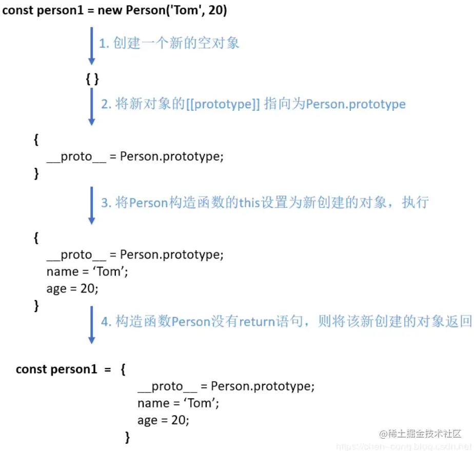

## new的时候干了什么

我们先来看看正常的代码

```js
// 啥也不返回
function Car (price) {
    this.price = price
}
const car = new Car(200)
console.log(car.price) // 200

// 返回值类型
function Car1 (price) {
    this.price = price
    return 20
}
const car1 = new Car1(300)
console.log(car1.price) // 300

// 返回引用类型
function Car2 (price) {
    this.price = price
    return {
        haha: 'dedede'
    }
}
const car2 = new Car2(400)
console.log(car2.price, car2.haha) // undefined, dedede
```

结论是：当返回值类型的时候和不返回是一样的，当返回引用类型时用最终的对象当返回

### new做了什么
- 新建一个空对象obj
- 将obj和构造函数的原型链接在一起
- 将this指向obj
- 调用构造函数
- 如果有返回值，判断为对象就把对象返回，其他情况就返回obj



### 实现一个new

```js
function myNew (func, ...args) {
    const obj = Object.create(func.prototype);
    const ret = func.apply(obj, args)
    return ret instanceof Object ? ret : obj
}
```

用上面的例子再试试吧