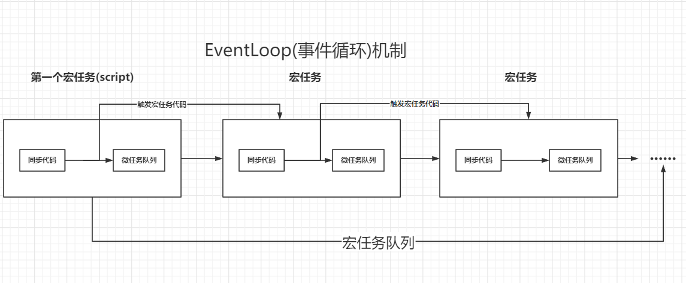

## 浏览器的事件循环EventLoop

一直有一个疑问：vue中dom的更新为什么在nextTick之前，这个就需要了解浏览器的事件循环

这里我们先了解一个概念，我们大家都知道js是单线程的，但是浏览器是多线程的

### js单线程
js的代码只能在一个线程中运行，就是说如果有很多js代码，同一时间只能执行一段代码，为什么要这样呢，js主要作用是和用户进行交互，大家可以想象一下，如果js运行在多线程上，一个线程增加dom a，另一个线程删除dom a，此时页面操作就混乱了。

这里要了解到，既然js是单线程，那么onclick，setTimeout，ajax这些操作怎么办呢，让宿主环境（浏览器，node）多启用几个线程辅助js主线程就好了，所以，实际上我们的js运行的时候是多个线程配合着的。

### 浏览器线程
这里我们先要了解一下进程和线程的区别

我们可以引用一个很形象的比喻，大家可以把浏览器当做一个工厂，一个进程就是一个车间，线程就是流水线，一个车间是有多个流水线的。

具体在浏览器中，一个tab标签页（一个页面）就是一个进程，一个页面（进程）又拥有多个线程

下面介绍一下浏览器的线程
#### 1、GUI渲染线程（可以理解是html css的渲染线程）
负责渲染浏览器界面HTML元素,当界面需要重绘(Repaint)或由于某种操作引发回流(reflow)时,该线程就会执行。**在Javascript引擎运行脚本期间,GUI渲染线程都是处于挂起状态的,也就是说被”冻结”了**.

#### 2、js线程
JS内核，负责处理Javascript脚本主程序。一直等待着任务队列（下面会讲什么是任务）中任务的到来，然后解析Javascript脚本，运行代码。浏览器中的一个Tab标签页（一个页面，也就是一个进程）中无论什么时候都只有一个JS线程在运行JS程序。

**GUI渲染线程与JS引擎线程是互斥的，所以如果JS执行的时间过长，这样就会造成页面的渲染不连贯，导致页面渲染加载阻塞。**

#### 3、定时器触发线程
- 定时器setInterval与setTimeout所在线程
- 浏览器定时计数器并不是由JavaScript引擎计数的 因为JavaScript引擎是单线程的, 如果处于阻塞线程状态就会影响记计时的准确,因此采用单独线程基数就比较准确
- 当定时器到时间后，会把回调函数重新放回js线程的任务队列中

#### 4、浏览器事件线程
- 用来控制事件，JS引擎自己忙不过来，需要浏览器另开线程协助
- 当JS引擎执行代码块如鼠标点击click、onload等等事件，会将对应任务添加到事件触发线程中
- 当对应的事件符合触发条件被触发时，该线程会把事件对应的函数添加到待处理任务队列的队尾，等待JS引擎的处理
- 由于JS的单线程关系，所以这些待处理任务队列中的事件都得排队等待JS引擎处理（当JS引擎空闲时才会去执行）

#### 5、http请求线程
在XMLHttpRequest在连接后是通过浏览器新开一个线程请求， 将检测到状态变更时，如果设置有回调函数，异步线程就产生状态变更事件放到 JavaScript引擎的任务队列中等待处理。

大家现在都知道了js是单线程的语言，所有的任务都在一个线程上面执行，任务排成一队，形成了队列，所以我们就称为任务队列
**这里说的任务可以理解成一行行代码，或则一个个代码块**
排在前面的任务先执行，排在后面的后执行，如果排在后面的很多，执行顺序就会发生混乱，这里就需要引入时间循环了

### 事件循环
事件循环机制，有这几个概念， 任务队列， 同步任务， 异步任务， 宏任务， 微任务。

任务队列：上面已经讲了

同步任务：就是js代码一行一行进入任务队列

异步任务：就是一些不阻塞主线程，需要额外事件额外线程辅助处理的任务

再来看看宏任务和微任务

浏览器执行代码的过程中,JS引擎会将代码进行分类,分别分到这两个队列中--宏任务(macrotask) 和 微任务(microtask) 

#### 常见的宏任务：
- setTimeout, setInterval, setImmediate(nodejs的),的回调函数
- ajax的回调函数
- I/O（nodejs）

#### 常见的微任务
- promise中的then()
- process.nextTikc(nodejs)

**微任务是宏任务的组成部分,微任务与宏任务是包含关系,并非前后并列，宏任务包含微任务.如果要谈微任务,需要指出它属于哪个宏任务才有意义.**


根据这个图，我们再来看一下**EventLoop(事件循环机制)**
- js引擎一行一行读取代码，此时算是第一个宏任务
- 当遇到setTimeout，setInterval等时就会放在宏任务队列中，浏览器线程会帮助处理
- 当遇到promise.then时，就会放入微任务列表中
- 继续往下执行，直到宏任务执行结束
- 这个时候去微任务列表中依次取出微任务执行
- 当微任务执行结束，我们再从宏任务列表中取出下一个宏任务进行执行，如此循环往复

### 扩展
1、dom操作属于宏任务还是微任务

dom操作它既不是宏任务也不是微任务,它应该归于同步执行的范畴.

2、requestAnimationFrame属于宏任务还是微任务

它既不能算宏任务,也并非是微任务.它的执行时机是在当前宏任务范围内,执行完同步代码和微任务队列后再执行.它仍然属于宏任务范围内,但是是在微任务队列执行完毕后才执行

3、promise问题
```js
new Promise((resolve)=>{
    console.log(1);
	resolve();
  }).then(()=>{
    console.log(2);
 })
```
promise包裹的代码是同步执行，then就放进微任务了


### 最后看一道面试题
```js
new Promise(resolve => {                  // 1
  setTimeout(()=>{                        // 2
      console.log(666);                   // 3
      new Promise(resolve => {            // 4
        resolve();                        // 5      
      })                                  // 6       
      .then(() => {console.log(777);})    // 7
  })                                      // 8       
  resolve();                              // 9
 })                                       // 10
 .then(() => {                            // 11
	     new Promise(resolve => {         // 12
	       resolve();                     // 13
	     })                               // 14
	     .then(() => {console.log(111);}) // 15
	     .then(() => {console.log(222);});// 16
 })                                       // 17
 .then(() => {                            // 18
	     new Promise((resolve) => {       // 19
	       resolve()                      // 20
	     })                               // 21
	    .then(() => {                     // 22
		     new Promise((resolve) => {   // 23
		       resolve()                  // 24
		     })                           // 25
		    .then(() => {console.log(444)})// 26
	     })                                // 27
	    .then(() => {                      // 28
	       console.log(555);               // 29
	    })                                 // 30
})                                         // 31
.then(() => {                              // 32
  console.log(333);                        // 33
})                                         // 34

```
看看解析吧
- 线程执行第一行代码,同步执行Promise包裹的函数.
- 在第二行发现定时器,启动一个宏任务,将定时器的回调放入宏任务队列等待,线程直接跳到第9行执行
- 第9行执行完开始执行第11行代码发现then函数,放入当前微任务队列中.线程往后再没有可以执行的代码了,于是开始执行微任务队列.
- 执行微任务队列进入第12行代码,运行到第15行代码时发现then函数放入微任务队列等待.随后线程直接跳到第18行,碰到then函数放到微队列中.后续没有可执行的代码了,再开始执行微任务队列的第一个任务也就是第15行代码输出111.
- 15行执行完执行到16行碰到then回调放入微任务队列等待.随后线程跳到18行的微任务开始执行,一直执行到22行碰到then函数又放入微任务队列等待.此时线程继续往下跳到第32行碰到then函数放入微任务队列等待.后续没有可执行的代码了,再开始执行微任务队列的第一个任务.
- 线程跳到第16行执行微任务输出 222，随后又跳到22行执行下一个微任务,在26行处碰到then函数放入微任务队列等待，继续往后执行，到28行碰到then函数回调放入微任务队列等待.线程继续执行下一个微任务跳到32行输出 333.至此这一轮的三个微任务全部执行完毕清空。
- 接着开始执行新加入的微任务,线程跳到第26行输出 444，接着线程跳到28行执行微任务即29行代码输出 555.
- 所有微任务执行完毕,当前宏任务结束.线程开始执行下一个宏任务,线程跳到第三行输出 666.
- 线程继续往后第7行碰到then回调放入微任务队列,后续没有可执行的代码了,再开始执行微任务队列的第一个任务输出 777.第二个宏任务执行完毕.

结果就是111 222 333 444 555 666 777


### 最后我们来看看开头的问题
vue中dom的更新为什么在nextTick之前，这个就需要了解浏览器的事件循环

vue中nextTick的实现其实是按环境调用了promise.then,MutationObserver,setImmediate，甚至setTimeout

而我们的dom更新实际上是异步的，同一段代码可能会有多个属性的set，当然就触发了多个watcher，vue是把同一段同步代码中的watcher放入了一个队列，当同步代码执行完毕之后调用nextTick(渲染队列执行渲染的方法)

所以总结可以得到

同步代码生成渲染队列 => nextTick(渲染队列执行渲染的方法) => nextTick(自定义方法)

根据上面任务队列我们就能知道调用顺序了