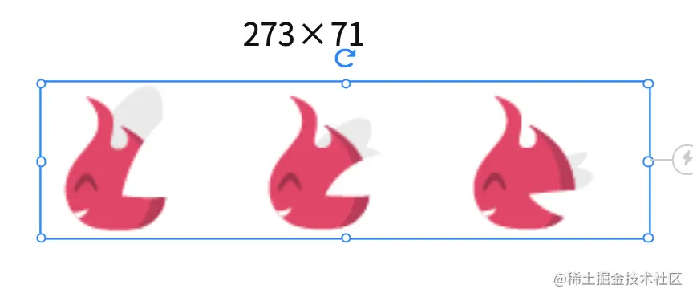

# 前端动画

我们在开发中遇到的很多动效，比如放大，缩小，渐入渐出，飞来飞去等等效果很多都可以通过css实现，很多复杂的动画也可以拆解成各个不相关的模块来单独实现动画，从而达到很炫的效果

## css简单动画

了解一下animation，参数中有

- animation-name 名称，可以定义变换方式
- animation-duration 时间，多久内完成变换
- animation-timing-function 动画的速度曲线。
- animation-delay 规定在动画开始之前的延迟。
- animation-iteration-count 规定动画应该播放的次数
- animation-direction 规定是否应该轮流反向播放动画 “alternate”

```js
#alice {
  animation: aliceTumbling infinite 3s linear;
}

@keyframes aliceTumbling {
  0% {
    color: #000;
    transform: rotate(0) translate3D(-50%, -50%, 0);
  }
  30% {
    color: #431236;
  }
  100% {
    color: #000;
    transform: rotate(360deg) translate3D(-50%, -50%, 0);
  }
}
```

在keyframes中我们可以定义不同的属性实现很多奇妙的效果

## 关键帧动画

我们偶尔也会遇到渲染图片的情况，gif图一般会很大，所以有时我们会使用一个雪碧图上面放一些关键帧图片，从而实现动画效果



要实现动画效果我们的样式可以这么写，这还是使用animation的简单方式

```js
.bird {
   min-width: 140px;
   min-height: 95px;
   top: 10%;
   right: 10%;
   position: absolute;
   z-index: 10;
   background: url(bird.png);
   background-size: 300% 100%;
   animation: bird-slow 400ms infinite;
}
bird-slow {
   0%{background-position:0 0;}
   50%{background-position:-100% 0;}
   75%{background-position:-200% 0;}
   100%{background-position:-300% 0;}
}
```

我们还可以使用step的方式，这样就会平均算出每一帧移动到的具体位置，从而实现动画效果

```js
.bird {
   min-width: 140px;
   min-height: 95px;
   top: 10%;
   right: 10%;
   position: absolute;
   z-index: 10;
   background: url(bird.png);
   background-size: 300% 100%;
   /* 400ms 换一次位置，一共3个图*/
   animation: bird-slow 400ms step(3) infinite;
}
bird-slow {
   0% {
    background-position: 0 0;
  }
  100% {
    background-position: -300% 0;
  }
}
```

## canvas动画

这个需要结合js一起实现，这个需要了解一系列api，可以花单独一片文章实现，这里不再讲解
