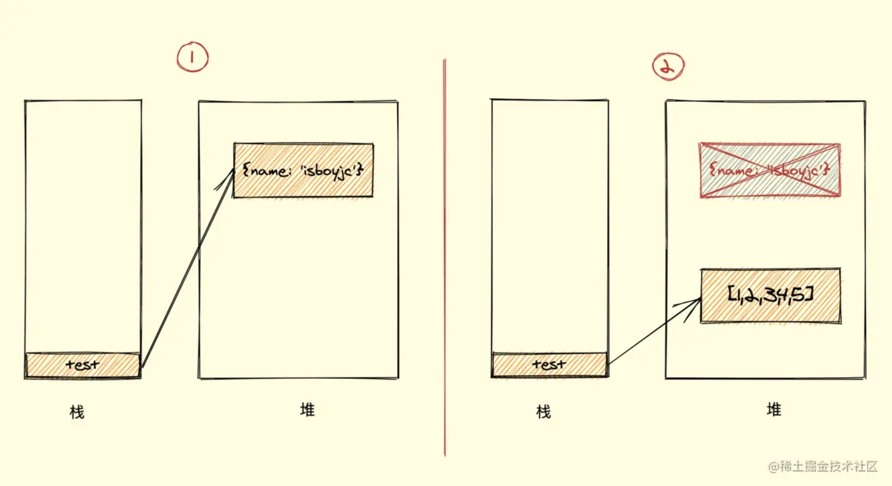
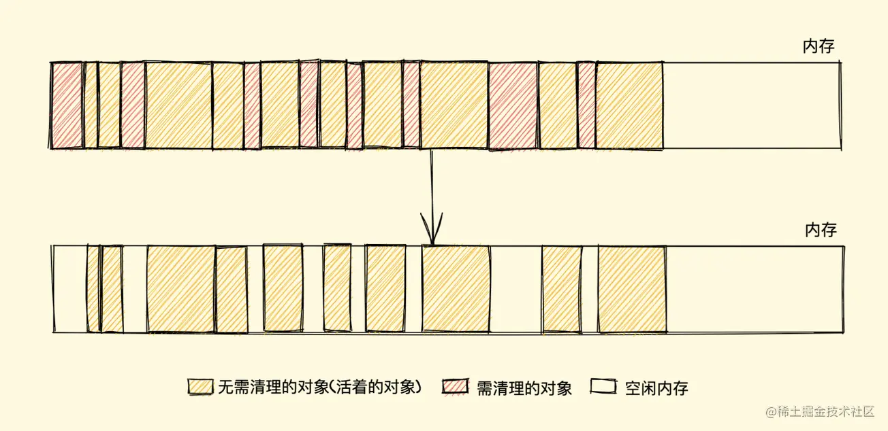
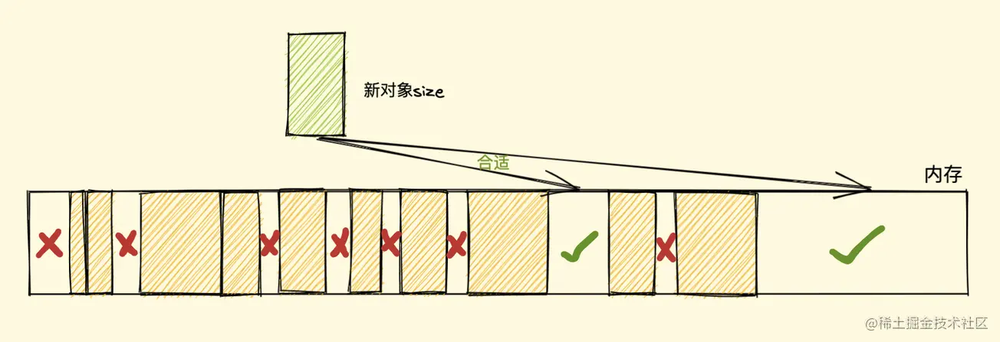
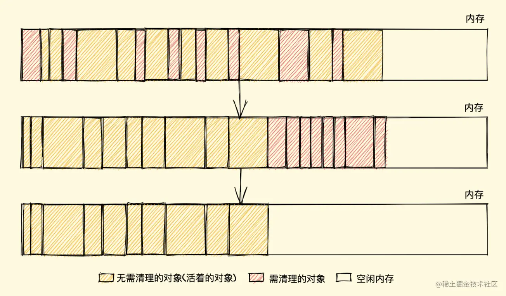

## javascript 垃圾回收

我们带着几个疑问

1、什么是垃圾回收机制

2、垃圾是怎样产生的

3、为什么要进行垃圾回收

4、垃圾回收怎么处理


### GC是什么
GC 就是Garbage Collection，程序工作过程中会产生垃圾，这些垃圾是程序不使用，或则已经使用过了并且以后也不会用的内存空间，GC就是回收这些内存空间的，因为他工作在引擎内部，对我们来说是无感知的，这一套操作就是我们平常说的垃圾回收机制了

有些语言会自带垃圾回收机制，比如java，javascript，python等，当然还有些语言是不带垃圾回收机制的，比如c，c++等，这就需要程序员去合理管理内存了

### 垃圾产生&为什么回收
我们知道当我们的程序在运行时，会自动给我们定义的基本类型或者引用类型提供内存空间，但是我们不用关注这些，这些都是引擎帮我们做的。

但是有没有想过，如果有个对象我们不再使用会发生什么呢

比如下面这个例子
```js
var test = {
    a: 1
}
test = [1, 2, 3]
```

上面我们可以理解在内存中分配了两个空间，一个给了{a:1}，另外一个给了[1, 2, 3]，test只是一个引用类型，存放的是个地址我们可以先不管，假设上面的程序是完整的，执行之后我们会发现{a:1}这块内存存放的东西已经没有用了，这就是垃圾产生的过程

用官方一点的话说，程序的运行需要内存，只要程序提出要求，操作系统或者运行时就必须提供内存，对于持续运行的程序来说，必须要及时释放内存，否则内存使用越来越高，轻则影响系统性能，重则直接造成系统崩溃

### 垃圾回收策略

在javascript内存管理中有个概念叫做可达性，就是以某些方式可访问或则可用的值，这些值就会存储到内存中，反之不可访问就需要被回收

至于如何进行垃圾回收其实就是如何找出这些不可访问的内存，并且用手段清除的过程。垃圾回收说白了就是定期找出不可访问的内存，然后加以释放

你可能还会好奇为什么不是实时的找出无用内存并释放呢？其实很简单，实时开销太大了
为什么开销大我们稍后可以看看两个垃圾回收的方法
- 标记清除
- 引用计数

#### 标记清除
标记清除，目前在javascript引擎中，这个算法是最常用的，到目前为止大部分浏览器都采用的这种方式，只是不同浏览器在这个算法上还做了加工，另外在回收的频率上也会有所差异

这个算法分为“标记”和“清除”两个阶段，标记阶段就是给所有活动内存做个标记，清除阶段就是把内存中没做标记的销毁

引擎在执行gc时，需要从出发点去遍历内存中所有的属性去打标，这个出发点有很多，我们统一称为根对象，而根对象就指的是全局window对象，文档dom树这些

其实就比如我们开发中遍历window下的所有属性获取到值对应的内存，打上标，然后递归操作，这样就能把所有使用到的内存全打上标，没打标的自然就是不可访问的内存，可以销毁

整个标记清除算法大致过程就像下面这样
- 垃圾收集器在运行时会给内存中的所有变量都加上一个标记，假设内存中所有对象都是垃圾，全标记为0，先付一个初始值
- 然后从各个根对象开始递归遍历，把不是垃圾的节点改成1
- 遍历完成后，清理所有标记为0的垃圾，销毁并回收它们所占用的内存空间
- 最后再把所有内存的标记置为0，等待下一次垃圾回收

##### 优点
标记清除算法的优点只有一个，那就是实现比较简单，打标记也无非打与不打两种情况，这使得一位二进制位（0和1）就可以为其标记，非常简单

##### 缺点
标记清除算法有一个很大的缺点，就是在清除之后，剩余的对象内存位置是不变的，也会导致空闲内存空间是不连续的，出现了 内存碎片


假设我们要对新对象分配内存时需要大小是size，由于空间内存是不连续的，我们需要单向遍历一遍找到比size大的内存块，才能将其分配


那如何找到合适的块呢？我们可以采取下面三种分配策略
- First-fit，找到大于等于 size 的块立即返回
- Best-fit，遍历整个空闲列表，返回大于等于 size 的最小分块
- Worst-fit，遍历整个空闲列表，找到最大的分块，然后切成两部分，一部分 size 大小，并将该部分返回

这三种策略里面 Worst-fit 的空间利用率看起来是最合理，但实际上切分之后会造成更多的小块，形成内存碎片，所以不推荐使用，对于 First-fit 和 Best-fit 来说，考虑到分配的速度和效率 First-fit 是更为明智的选择

综上所述，标记清除算法或者说策略就有两个很明显的缺点
- 内存碎片化，空闲内存块是不连续的，容易出现很多空闲内存块，还可能会出现分配所需内存过大的对象时找不到合适的块
- 分配速度慢，因为即便是使用 First-fit 策略，其操作仍是一个 O(n) 的操作，最坏情况是每次都要遍历到最后，同时因为碎片化，大对象的分配效率会更慢

#### 标记整理算法
它的标记阶段和标记清除算法没有什么不同，只是标记结束后，标记整理算法会将活着的对象（即不需要清理的对象）向内存的一端移动，最后清理掉边界的内存


### 引用计数算法
引用计数（Reference Counting），这其实是早先的一种垃圾回收算法，它把 **对象是否不再需要** 简化定义为 **对象有没有其他对象引用到它**，如果没有引用指向该对象（零引用），对象将被垃圾回收机制回收，目前很少使用这种算法了，因为它的问题很多

他的整个算法核心如下
- 当声明了一个变量，并且将一个引用类型的值赋值给该变量时，这个值就赋值为1
- 如果这个值赋值给了其他值，引用计数就+1
- 如果当这个值被覆盖掉，引用计数就-1
- 当这个值得引用计数变成0的时候，就说明没有变量在使用，这个值没法被访问了，垃圾回收的时候就可以清理掉了

像下面这样
```js
let a = new Object() 	// 此对象的引用计数为 1（a引用）
let b = a 		// 此对象的引用计数是 2（a,b引用）
a = null  		// 此对象的引用计数为 1（b引用）
b = null 	 	// 此对象的引用计数为 0（无引用）
// GC 回收此对象
```

这个方法很简单，但是没多久这个方法就出现了一个严重问题，循环引用
```js
function test(){
  let A = new Object()
  let B = new Object()
  
  A.b = B
  B.a = A
}
```
我们再用标记清除的角度看一下，当函数结束后，两个对象都不在作用域中，A和B都会被清除掉，但是他们指向的值的计数变成了2，A和B清除的时候计数只会分别减1，所以GC的时候是不会清除的，如果这段代码重复使用就会造成内存大量无效占用

##### 优点
引用计数算法的优点我们对比标记清除来看就会清晰很多，首先引用计数在引用值为 0 时，也就是在变成垃圾的那一刻就会被回收，所以它可以立即回收垃圾

标记清除算法需要隔一段时间执行一次，且是遍历一整个内存空间，效率上比标记清除要高

##### 缺点
- 每个内存需要一个计数器，计数器也是很占内存空间的
- 无法解决循环引用的问题
