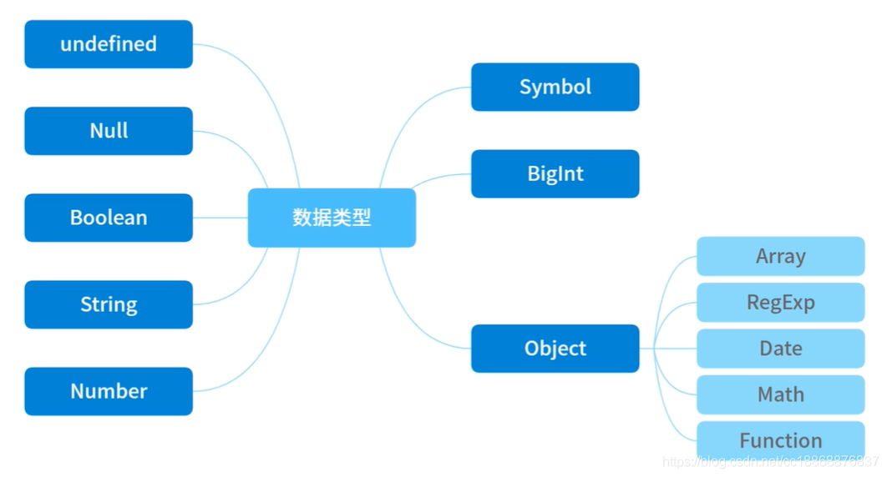

## 对象拷贝

深拷贝我们要考虑以下几个方面
- 基本数据类型是否可以拷贝
- 键和值为基本类型的对象是否可以拷贝
- Symbol为key是否可以拷贝
- Date和RegExp是否可以拷贝
- Map和Set对象是否可以拷贝
- Function类型是否可以拷贝
- 对象的原型是否可以拷贝
- 不可枚举属性是否可以拷贝
- 循环应用是否可以拷贝

js的数据类型如下


基础数据类型在js内存中是保存了一份值，而引用数据类型是保存的是一个地址，这个已经是常识了。

针对以上考虑，我们创建一个对象，包含以上数据
```js
const obj = {
    // =========== 1.基础数据类型 ===========
    num: 0, // number
    str: '', // string
    bool: true, // boolean
    unf: undefined, // undefined
    nul: null, // null
    sym: Symbol('sym'), // symbol
    bign: BigInt(1n), // bigint

    // =========== 2.Object类型 ===========
    // 普通对象
    obj: {
        name: '我是一个对象',
        id: 1
    },
    // 数组
    arr: [0, 1, 2],
    // 函数
    func: function () {
        console.log('我是一个函数')
    },
    // 日期
    date: new Date(0),
    // 正则
    reg: new RegExp('/我是一个正则/ig'),
    // Map
    map: new Map().set('mapKey', 1),
    // Set
    set: new Set().add('set'),
    // =========== 3.其他 ===========
    [Symbol('1')]: 1  // Symbol作为key
};
// 4.添加不可枚举属性
Object.defineProperty(obj, 'innumerable', {
    enumerable: false,
    value: '不可枚举属性'
});

// 5.设置原型对象

Object.setPrototypeOf(obj, {
    proto: 'proto'
})

// 6.设置loop成循环引用的属性
obj.loop = obj
```

### 先看一下浅拷贝
浅拷贝实际上就是把当前对象中的基础值属性直接复制值给新的对象，如果当前对象的属性是对象属性，复制对象地址给新的对象，这样就会产生一个问题，如果老的对象中引用对象的值发生变化了，新的对象也会发生变化。

我们看一下浅拷贝的方法
- Object.assign()
  - 1、不会拷贝对象原型上的属性；
  - 2、不会拷贝对象的不可枚举的属性；
  - 3、可以拷贝 Symbol 类型的属性。
  
- 展开式语法 let objClone = { ...obj }
  - 缺陷和assign差不多

- Array.prototype.concat()拷贝数组
  - 浅拷贝，适用于基本类型值的数组

- Array.prototype.slice()拷贝数组
  - 浅拷贝，适用于基本类型值的数组


但是如果属性都是基本类型的值，使用扩展运算符进行浅拷贝会更加方便。

手动实现一个浅拷贝
```js
function shadowClone (target) {
    if(typeof target === 'object' && target !== null){
        const cloneTarget = Array.isArray() ? [] : {};

        for (let i in target) {
            if (target.hasOwnProperty(i)) {
                cloneTarget[i] = target[i]
            }
        }
    } else {
        return target
    }
}
```
这样实现从代码中就能看出一些问题，for...in语句以任意顺序遍历一个对象的除Symbol以外的可枚举属性，包含原型上的属性
- 可以拷贝原型上的属性
- 不会拷贝对象的不可枚举的属性，（遍历不出来）
- 不会拷贝 Symbol 类型的属性，（遍历不出来）

### 深拷贝
深拷贝：创建一个新的对象，将一个对象从内存中完整地拷贝出来一份给该新对象，并从堆内存中开辟一个全新的空间存放新对象，且新对象的修改并不会改变原对象，二者实现真正的分离。

#### JSON.stringfy
其实就是将一个 JavaScript 对象或值转换为 JSON 字符串，最后再用 JSON.parse() 的方法将JSON 字符串生成一个新的对象。
```js
function shadowClone (target) {
    if(typeof target === 'object' && target !== null){
       return JSON.parse(JSON.stringify(target))
    } else {
        return target
    }
}
```

从以上结果我们可知JSON.stringfy() 存在以下一些问题：
- 执行会报错：存在BigInt类型、循环引用。
- Date对象类型变成了字符串
- 键值会消失：对象的值中为Function、Undefined、Symbol 这几种类型，
- 键值变成空对象：对象的值中为Map、Set、RegExp这几种类型。
- 无法拷贝：不可枚举属性、对象的原型链。
- NaN 和 Infinity 格式的数值及 null 都会被当做 null。

由于以上种种限制条件，JSON.stringfy() 方式仅限于深拷贝一些普通的对象，对于更复杂的数据类型，我们需要另寻他路

#### 递归基础版实现深拷贝
我们需要完成两点
- 对于基础类型，我们只需要简单地赋值即可（使用=）
- 对于引用类型，我们需要创建新的对象，然后遍历键值对，如果值再次遇到object则再重复前面的操作

```js
function shadowClone (target) {
    if(typeof target === 'object' && target !== null){
        let cloneObj = {};
        for (const prop in target) {
            const val = target[prop]
            if (typeof val === 'object' && val !== null) {
                cloneObj[prop] = shadowClone(val)
            } else {
                cloneObj[prop] = val
            }
        }
        return cloneObj
    } else {
        return target
    }
}
```

这种处理，看结果仍然有很多问题
- 不能处理循环引用，递归的时候会导致堆栈溢出，会报错
- 只考虑了Object对象，Date对象、RegExp对象、Map对象、Set对象都变成了Object对象，处理的时候当进行递归时，for in遍历不出属性，结果这些对象就全部成了{}；而Array对象遍历时从array变成了对象，赋值不正确
- 丢失了属性名为Symbol类型的属性 for in 遍历不出来
- 丢失了不可枚举的属性。for in 遍历不出来
- 原型上的属性也被添加到拷贝的对象中了，没有在拷贝对象的原型上了。

#### 递归完美版深拷贝
对于基础版深拷贝存在的问题，我们一一改进：
- 不能处理循环引用 使用 WeakMap 作为一个Hash表来进行查询
- 只考虑了Object对象 当参数为 Date、RegExp 、Map、Set，则直接生成一个新的实例返回
- 属性名为Symbol的属性
- 丢失了不可枚举的属性
   -  针对能够遍历对象的不可枚举属性以及 Symbol 类型，我们可以使用 Reflect.ownKeys() **注：Reflect.ownKeys(obj)相当于[...Object.getOwnPropertyNames(obj), ...Object.getOwnPropertySymbols(obj)]**
- 原型上的属性 Object.getOwnPropertyDescriptors()设置属性描述对象，以及Object.create()方式继承原型链

```js
function deepClone (target) {
    // weakmap作为记录对象的hash表（用于防止循环引用）
    const map = new WeakMap();
    // 判断是否为object和function
    function isObject (target) {
        return (typeof target === 'object' && target !== null) || typeof target === 'function'
    }

    function clone (data) {
        // 基础类型直接返回
        if (!isObject(data)) {
            return data
        }
        // 日期或则正则对象，用响应
        if ([Date, RegExp].includes(data.constructor)) {
            return new data.constructor(data)
        }

        // 如果该对象存在就直接返回
        // const exist = map.get(data);
        // if (exist) {
        //     return exist
        // }

        // 处理map对象
        if (data instanceof Map) {
            const result = new Map()
            // map.set(data, result)
            data.forEach((val, key) => {
                // 注意：map中的值为object的话也得深拷贝
                if (isObject(val)) {
                    result.set(key, clone(val))
                } else {
                    result.set(key, val)
                }
            })
            return result
        }
        // 处理set对象
        if (data instanceof Set) {
            const result = new Set()
            // map.set(data, result)
            data.forEach(val => {
                // 注意：set中的值为object的话也得深拷贝
                if (isObject(val)) {
                    result.add(clone(val))
                } else {
                    result.add(val)
                }
            })
            return result
        }

        // 处理不可枚举属性，以及Symbol作为key的属性
        const keys = Reflect.ownKeys(data)
        // 利用 Object 的 getOwnPropertyDescriptors 方法可以获得对象的所有属性以及对应的属性描述
        const allDesc = Object.getOwnPropertyDescriptors(data)
        // 结合 Object 的 create 方法创建一个新对象，并继承传入原对象的原型链， 这里得到的result是对data的浅拷贝
        const result = Object.create(Object.getPrototypeOf(data), allDesc)

        keys.forEach(key => {
            const val = data[key];
            if (isObject(val)) {
                result[key] = clone(val)
            } else {
                result[key] = val
            }
        })

        return result
    }

    return clone(target)
}
```


> 原文链接：https://blog.csdn.net/cc18868876837/article/details/114918262