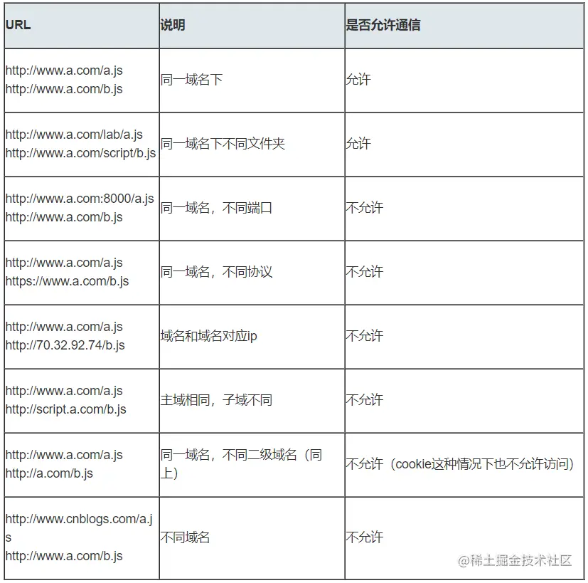

# 跨域

## 什么是跨域

### 同源策略

同源策略是一种约定，这是浏览器最核心也最基本的安全功能，如果少了同源策略，浏览器很容易受到xss，csrf攻击。同源指的是“协议+域名+端口”，三者必须相同，即便是不同域名指向同一ip地址也不行。

同源策略会有限制内容

- cookie，localstorage，indexedDb等
- dom节点
- ajax请求时会被浏览器拦截

但是有**3个标签是允许跨域**请求的，其实这三个在开发中咱们经常会遇到过，实际上他们也是发请求到服务器，只是我们不用处理返回，所以关注的就比较少

- \
- \<link href="">
- \<scripr src="">

### 常见跨域情景

只要协议，主域名，子域名端口号任意一个不同时，都算作不同域



这里要说明一下，跨域的时候请求并不是没有发出去，请求实际上发出去了，但是浏览器会拦截请求返回，也就不能在前段页面体现请求结果

## 跨域解决方案

### 1、jsonp

实际上利用的是script，先看一下使用方式

```js
// 前端代码
<script type="text/javascript">
function callbackFunction(result, methodName)
{
    var html = '<ul>';
    for(var i = 0; i < result.length; i++)
    {
        html += '<li>' + result[i] + '</li>';
    }
    html += '</ul>';
    document.getElementById('divCustomers').innerHTML = html;
}
</script>
<script type="text/javascript" src="https://www.runoob.com/try/ajax/jsonp.php?jsoncallback=callbackFunction"></script>
```

```php
// 后端代码
<?php
header('Content-type: application/json');
//获取回调函数名
$jsoncallback = htmlspecialchars($_REQUEST ['jsoncallback']);
//json数据
$json_data = '["customername1","customername2"]';
//输出jsonp格式的数据
echo $jsoncallback . "(" . $json_data . ")";
?>
```

jsonp的实现流程

- 创建一个callback函数，函数参数是后台返回的数据
- 用一个script标签包住我们跨域的请求
- 前后端要约定一个参数作为callback
- 后段接受请求处理完成后使用特定方式返回给前端
- 浏览器接收到的实际上是script包着的一段js代码，这段代码中会调用前面定义的callback函数，并把后台返回的数据传递过去

jsonp的优缺点

- 优点，很简单，可用于解决主流浏览器的跨域问题
- 缺点，只能处理get请求，有局限性，容易受到xss攻击

### 2、cors

服务端设置 Access-Control-Allow-Origin 就可以开启 CORS。 这个属性表示哪些域名可以访问这个资源，如果配置成通配符*就表示所有域名都可访问

### 3、postMessage

postMessage是为数不多的可以跨域操作的window属性之一，用于解决以下几个问题

- 跨窗口通信
- 嵌套iframe通信
- 页面和打开窗口之间的通信

主要语法结构

```js
otherWindow.postMessage(message, targetOrigin, [transfer]);
```

这里的otherWindow指的是其他窗口的引用，如window.open,iframe.contentWindow，还有数字索引的iframe，window.frames

看一个例子

```js
// a.html
  <iframe src="http://localhost:4000/b.html" frameborder="0" id="frame" onload="load()"></iframe> //等它加载完触发一个事件
  //内嵌在http://localhost:3000/a.html
    <script>
      function load() {
        let frame = document.getElementById('frame')
        frame.contentWindow.postMessage('我爱你', 'http://localhost:4000') //发送数据
        window.onmessage = function(e) { //接受返回数据
          console.log(e.data) //我不爱你
        }
      }
    </script>

// b.html
  window.onmessage = function(e) {
    console.log(e.data) //我爱你
    e.source.postMessage('我不爱你', e.origin)
 }
```

### 4、websocket

WebSocket和HTTP都是应用层协议，都基于 TCP 协议，**websocket是一种双向通信协议，在建立连接后，websocket的客户端和移动端就可以主动向对方发送和接收数据了**，websocket只在建立连接时需要http协议，当连接建立后就和http无关了

### 5、node中间件

这个主要是依赖后端开发，同源策略是浏览器需要遵循的标准，但是后端就没有这个限制了，在实际开发中我们经常也会遇到这种情况，请求的数据跨域，通常我们会让后台同学给我们包一层，主要方法如下

- 接收客户端请求
- 像目标服务器请求
- 把目标服务器数据转发给客户端

### 6、nginx反向代理（这个还不太了解）

通过nginx配置一个代理服务器（域名与domain1相同，端口不同）做跳板机，反向代理访问domain2接口，并且可以顺便修改cookie中domain信息，方便当前域cookie写入，实现跨域登录。

### 7、window.name + iframe

window.name属性的独特之处：name值在不同的页面（甚至不同域名）加载后依旧存在，并且可以支持非常长的 name 值（2MB）。

当然直接请求一个不同域的window.name仍然会报错的

实现：通过iframe的src属性由外域转向本地域，跨域数据即由iframe的window.name从外域传递到本地域。这个就巧妙地绕过了浏览器的跨域访问限制，但同时它又是安全操作。

具体实现

```js
// a.html(http://localhost:3000/b.html)
  <iframe src="http://localhost:4000/c.html" frameborder="0" onload="load()" id="iframe"></iframe>
  <script>
    let first = true
    // onload事件会触发2次，第1次加载跨域页，并留存数据于window.name
    function load() {
      if(first){
      // 第1次onload(跨域页)成功后，切换到同域代理页面
        let iframe = document.getElementById('iframe');
        iframe.src = 'http://localhost:3000/b.html';
        first = false;
      }else{
      // 第2次onload(同域b.html页)成功后，读取同域window.name中数据
        console.log(iframe.contentWindow.name);
      }
    }
  </script>
// b.html为空，可以不管

// c.html
<script>
    window.name = '我不爱你'  
</script>
```

### location.hash + iframe

实现原理：a.html欲与c.html跨域相互通信，通过中间页b.html来实现。 三个页面，不同域之间利用iframe的location.hash传值，相同域之间直接js访问来通信。

主要有两点

- 在c中创建一个中间iframe b，然后把生成的数据放在b的hash中，注意这里b和a是同源的
- b中可以通过window.parent.parent访问到a页面

具体实现

```js
// a.html
  <iframe src="http://localhost:4000/c.html#iloveyou"></iframe>
  <script>
    window.onhashchange = function () { //检测hash的变化
      console.log(location.hash);
    }
  </script>

// b.html
  <script>
    window.parent.parent.location.hash = location.hash 
    //b.html将结果放到a.html的hash值中，b.html可通过parent.parent访问a.html页面
  </script>

// c.html
 console.log(location.hash);
  let iframe = document.createElement('iframe');
  iframe.src = 'http://localhost:3000/b.html#idontloveyou';
  document.body.appendChild(iframe);

```

### 9、document.domain + iframe

该方式只能用于二级域名相同的情况下，比如 a.test.com 和 b.test.com 适用于该方式。 只需要给页面添加 document.domain ='test.com' 表示二级域名都相同就可以实现跨域。
