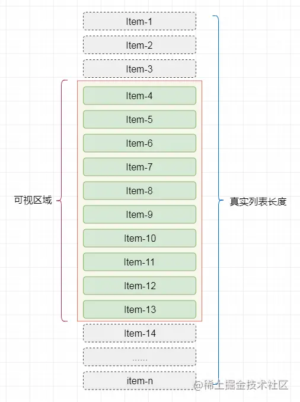

# 长列表

长列表在工作中偶尔还是会遇到的，虽然大部分情况我们都是使用分页加载的方式。对于这种一下渲染很多数据的情况我们称之为长列表

如果有10000条数据，我们一次性渲染出来的话会花很长时间，因为长列表意味着结构很大的dom树，当我们用控制台工具时会发现很大的时间消耗在布局计算和绘制上

## 时间分片

第一种解决办法是使用时间分片的方式，这种情况更像是一种分页加载机制，使用浏览器的requestAnimationFrame，然后每祯渲染一部分数据，直至渲染结束，这样总体时间会加长因为涉及回流和重绘，但是白屏时间就会显著减少

## 虚拟列表

现在最常见的方式就是虚拟列表了


总体实现方式如下

```js
<div class="infinite-list-container">
    <div class="infinite-list-phantom"></div>
    <div class="infinite-list">
      <!-- item-1 -->
      <!-- item-2 -->
      <!-- ...... -->
      <!-- item-n -->
    </div>
</div>
```

- infinite-list-container 为可视区域的容器
- infinite-list-phantom 为容器内的占位，高度为总列表高度，用于形成滚动条
- infinite-list 为列表项的渲染区域

实现方式如下

- 父容器定义固定可视高度
- 我们首先得到列表的总体高度，把高度赋值给占位元素infinite-list-phantom，主要目的是撑开父容器，可以发生滚动
- 根据父元素的高度我们可以得到一屏需要渲染的元素数量，然后一开始的时候渲染响应子元素
- 监听父元素的滚动事件，根据父元素的滚动位置，来计算当前需要渲染哪些元素，然后替换掉原来的元素

这样就可以保证可是区域内永远只有少量的dom结构，会大大减少dom的计算和渲染时间
