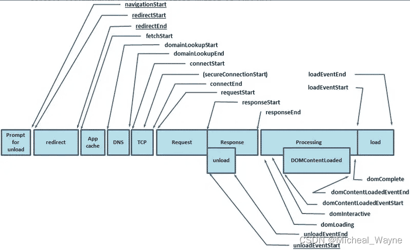

# 提升首屏加载速度

## 性能指标

RAIL模型

- Response 响应
- Animation 动画
- Idle 空闲
- Load 加载

一些常用指标

- FCP（First Contentful Paint）首次内容绘制，测量页面从开始加载到页面内容的任何部分在屏幕上完成渲染的时间
- FMP（First Meaningful Paint）首次有效绘制，当主要内容呈现在页面上
- LCP（Largest Contentful Paint）最大内容绘制，测量页面从开始加载到最大文本或图像元素在屏幕上完成渲染的时间

## 什么是首屏加载

首屏加载时间，指的是浏览器从用户输入网址，到首屏内容渲染完成的时间，此时网站所有页面并不一定全部渲染完成，但是要展示当前视窗需要的内容，首屏加载时用户体验的重要环节

其实就是指标中的FCP，计算方式如下 (performance.timing.domComplete - performance.timing.navigationStart) / 1000

## 后端

- 请求聚合
- 逻辑后置，前端只负责渲染与交互

## 前端提升首屏加载速度

一个页面请求从输入地址到浏览器拿到response，再到解析response，再到正式渲染是由很多步骤的，比如域名解析，服务器寻址，tcp握手等等，那我们就需要从每个阶段来进行优化

解析response又有很多流程，比如js，css资源加载，js执行阻塞等等

### 网络方面

- cdn静态资源缓存，比如vue，axios，lodash等等
- 合理利用localstorage
- 采用http缓存
- http2
- 资源的合并，虽然有http2解决了tcp链接问题，仍然可能有带宽问题
- 多机部署静态资源

### 浏览器解析方面，这个是前端优化比较多的地方

#### 减少入口文件体积

最常用的手段就是路由懒加载了，只有在解析路由的时候才回去加载组件

#### ui框架按需加载

比如 import { Button } from 'antd'

#### 避免组件重复打包

webpack配置中修改CommonChunkPlugin的minChunks：2，同一块代码超过两次引用就抽离出来

#### 图片资源压缩

比如小图片

#### js资源压缩

使用webpack的插件

