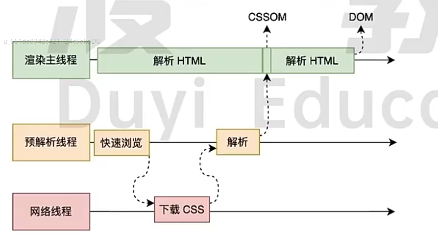
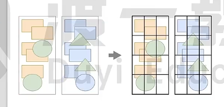
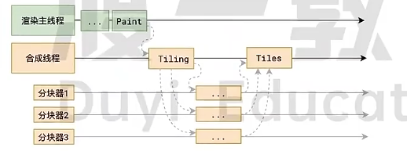

# 浏览器是如何渲染页面的

当地址栏输入地址后，浏览器就会启用一个网络线程去下载html，当收到html文档后就会产生一个渲染任务，并将其传递给渲染主线程的网络队列

在事件循环机制的作用下，渲染主线程会取出消息队列中的渲染任务，开启渲染进程

整个渲染流程像是一个流水线一样分为多个阶段，分别是：HTML解析，样式计算，布局，分层，绘制，分块，光栅化，画图

每个阶段都有明确的输入输出，上一个阶段的输出会成为下一个阶段的输入

## 渲染的第一步是解析HTML

解析过程中遇到css解析css，遇到js执行js。为了提高效率，浏览器在开始解析前，会启动一个与解析线程，率先下载html中的外部css文件和外部js文件

如果主线程解析到link为止，此时外部的css文件还没有下载解析好，主线程不会等待，继续解析后续的html，这是因为下载和解析css的工作是在预解析线程中惊醒的，这就是css不会阻塞HTML解析的根本原因

如果主线程解析到script位置，就会停止解析HTML，转而等待js文件下载好，并将全局代码解析执行完成后，才能继续解析HTML，这是因为js代码执行过程中可能会修改当前DOM树，所以DOM树的生成必须暂停。这就是js会阻塞HTML解析的根本原因

第一步完成之后，会得到DOM树和CSSOM树，浏览器的默认样式，外部样式，内部样式，行内样式都会包含在CSSOM树中

### HTML解析过程中遇到了css代码怎么办？

为了提高解析效率，浏览器会启动一个预解析器率先下载和解析css，这里仍然依靠网络线程下载

## 渲染的下一步是样式计算

主线程会遍历得到的DOM树，依次为书中的每个节点计算出最终节点，称之为Computed Style（这个在浏览器开发工具中可以看到）

在这一过程中，很多预设值会变成绝对值，比如red会变成rgb(255, 0, 0)，相对单位也会变成绝对单位，比如rem会变成px

这一步完成后会得到一颗带有样式的DOM树

## 接下来就是布局

遍历DOM树生成Layout树，计算出每个节点的尺寸和位置

DOM树和Layout树节点不太一样，比如有些dispaly：none的元素在Layout中就不存在，伪类在不在DOM树中，但是会出现在Layout中

## 下一步是分层

主线程会使用一套复杂的策略对整个布局书中进行分层

分层的好处在于，将来某一个层改变后，仅会对盖层进行后续处理，从而提升效率

滚动条，堆叠上下文，transform，opacity等样式都会影响分层结果，也可以通过will-change属性最大程度影响分层结果

## 再下一步是绘制

主线程会为每个层单独产生绘制指令集，用于描述这一层的内容该如何画出来

渲染主线程到这里所有的工作就干完了，剩下的步骤交给其他线程完成

### 绘制指令
有些像canvas画图，比如将笔移动到10,30位置，画一个200*300的矩形，背景颜色是绿色

实际上canvas画图的时候就是调用的浏览器内核开放出来的功能

## 分块

浏览器的窗口就只有那么大，所以要对页面进行分块，这样只画视口区域及其附近的位置就好了

分块的工作是交给多个线程同时进行的，这里也在渲染进程里面中的合成线程

## 分块完成之后进入光栅化阶段

合成线程会将信息交给GPU进程，以极高的速度完成光栅化

GPU进程会开启多个线程来完成光栅化，并且优先处理靠近视口区域的块

光栅化的结果，就是一块块的位图

## 最后一步就是画了

合成线程拿到每个层每个块的位图后，生成一个个的指引信息（相对于屏幕的位置），指引会标识出每个位图会标识出每个位图应该画到屏幕的位置，以及旋转，朔方变形

变形发生在合成线程，和渲染主线程无关，这就是transform效率高的本质原因

合成线程会把指引信息交给