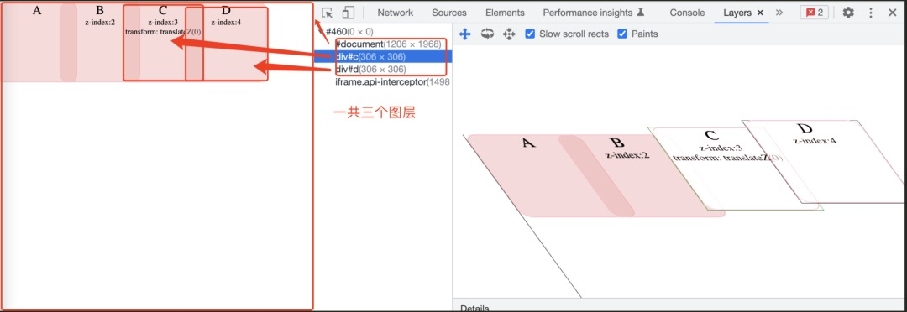

# 硬件加速中的层和层叠上下文中的层是一个东西吗

带着以下几个问题讲解一下

- 什么是硬件加速
- 硬件加速中的层和层叠上下文中的层是一个东西吗
- 层爆炸和层压缩是什么东西
- 都说要减少回流重绘，怎么使用硬件加速做到

首先我们需要了解浏览器的渲染过程，这个在重排和重绘那里已经讲过了，主要分为以下几步

- 构建DOM树
- 计算css规则
- 布局定位
- 图层分层
- 图层绘制
- 合成显示

在css改变时会触发重新渲染，主要有三种情况，回流，重绘，直接合成，分别对应上面的3个阶段，布局定位，图层绘制，合成显示

- 回流：在改变元素大小位置时，会导致其他元素联动，这个时候就会触发回流
- 重绘：只改变了不影响布局的属性，比如颜色
- 直接合成：合成层的元素属性发生变化，或者改变了transform、opacity等属性，只会将多个图层进行合并，然后重新渲染到屏幕上

## 渲染中的层

浏览器中的层就分为这两种，渲染层和合成层（或者复合层，图形层），可以在chrome中使用layer查看层级



### 渲染层

指的就是我们普通的文档流document，当文档流中出现拥有z-index的定位元素时，就会形成一个新的渲染层

当然形成渲染层的方式有很多

- document
- 拥有z-index的定位元素
- 弹性布局的子项，display：flex｜inline-flex
- opacity不为1的元素
- transform非none的元素
- filter非none的元素
- will-change=opacity｜filter｜transform
- 裁剪元素，overflow不为visible的元素

### 合成层

- transform3d变换
- will-change=opacity｜filter｜transform
- video，canvas，iframe

合成层实际上是渲染层的加强版，实际上形成条件更苛刻

我们看一个例子

```js
<style>
  body{
    margin:0;
    padding:0;
  }
  .box {
    width: 100px;
    height: 100px;
    background: rgba(240, 163, 163, 0.4);
    border: 1px solid pink;
    border-radius: 10px;
    text-align: center;
  }
  #a {
  }
  #b {
    position: absolute;
    top:0;
    left: 80;
    z-index: 2;
  }
  #c {
    position: absolute;
    top:0;

    left: 160;
    z-index: 3;
    transform: translateZ(0);
  }
  #d {
    position: absolute;
    top:0;

    left: 240;
    z-index: 4;
  }
  .description {
    font-size: 10px;
  }
</style>

<div id="a" class="box">A</div>
<div id="b" class="box">
  B
  <div class="description">z-index:2</div>
</div>
<div id="c" class="box">
  C
  <div class="description">z-index:3</div>
  <div class="description">transform: translateZ(0)</div>
</div>
<div id="d" class="box">
  D
  <div class="description">z-index:4</div>
</div>
```

上面例子中会发现一个问题，d元素本来应该是渲染层，但是却被提升到了合成层，这就是我们下面一个概念，隐式合成

### 隐式合成

当出现一个合成层时，所有比他层级高的堆叠元素都会发生隐式合成。**这个很重要，这是我们容易遗漏的一个性能问题**

### 层爆炸和层压缩

我们在开发的时候会遇到一个问题：在低端机上会发现页面动画卡顿或者不流畅的情况。这个时候就可以排查一下是不是遇到了层爆炸

隐式合成会造成一些预期之外的合成层，当然合成层并不是越多越好，合成层的渲染是消耗gpu性能的，很多合成层的消耗就会造成页面卡顿。这里一个优化方案就是提升合成层的z-index。

不过有些浏览器做了优化，也就是层压缩机制----多个渲染层和同一个合成层发生重叠时，会自动合成到一起不会生成额外的合成层

## 硬件加速

浏览器会对合成层采用硬件加速的方式，这就好比在cpu之外开了一个小外挂，单独处理这些合成层，可以减轻主线程的压力

而且还有一个好处就是，合成层上的修改不会影响其他元素，不至于牵一发动全身

我们再看一个例子

```js
<style>
  .box {
    width: 100px;
    height: 100px;
    background: rgba(240, 163, 163, 0.4);
    border: 1px solid pink;
    border-radius: 10px;
    text-align: center;
  }
  #a {
  }
  #b {
    position: absolute;
    top: 50;
    left: 50;
    z-index: 2;
    animation: width-change 5s infinite;
  }
  @keyframes width-change {
    0% {
      width: 80px;
    }
    100% {
      width: 120px;
    }
  }

  .description {
    font-size: 10px;
  }
</style>

<div id="a" class="box">A</div>
<div id="b" class="box">
  B
  <div class="description">animation:width-change</div>
</div>
```

在这里我们查看layer时会发现只有一个层document，并且b元素的改变会一直导致document层的重绘

我们在b元素上加上，will-change：transform就会发现在layer中新生成了一个层，这是只有b元素会重绘，document就不会重绘了

这就是硬件加速的意义，当我们讲到性能优化时，经常说到回流重绘，能避免当然更好，如果不能避免就可以开启硬件加速，只让一小部分元素来进行回流重绘

当然有得必有失，像前面我们讲过的隐式合成，如果我们合成层太多，就是造成gpu压力，这样会造成卡顿等问题，适得其反，所以要找一个平衡点

## 优化渲染性能

上面讲到了把需要重排和重绘的元素拎出来，减少绘制面积，还有以下方式

- 使用transform：translate代替left/top等属性，scale代替宽高等属性
- 注意隐式合成，给合成层一个大点的z-index
- 减少合成层的占用内存，比如可以使用10x10表达100x100，结合scale使用（这个我没试过）
