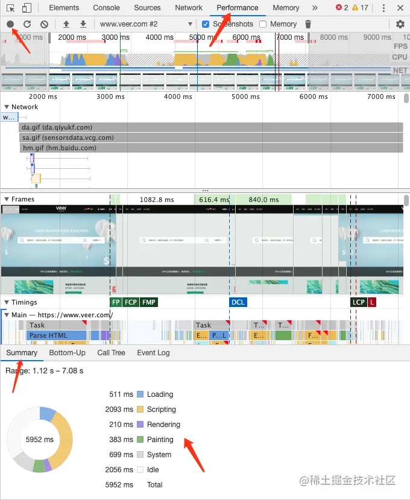
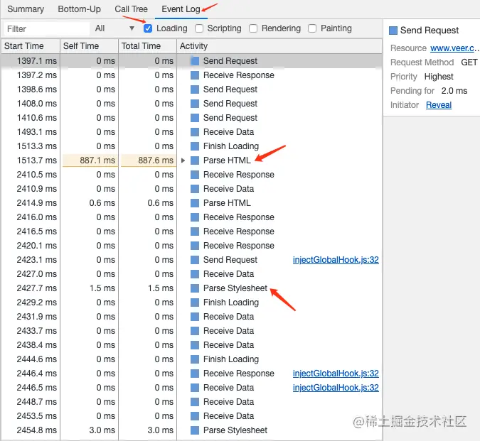

## 浏览器重绘和重排及优化方案

### 什么是重绘和重排
这个其实要从浏览器渲染机制上说，浏览器渲染主要分为以下几步
- 获取html，解析html的时候遇到js就会阻塞，因为js有可能操作dom，如果不阻塞就有可能出现，生成dom树后，js操作dom，需要重新生成的问题，获取所有html后生成dom树
- 获取css，生成响应的css规则
- 结合dom树和css规则，生成一个渲染树
- 生成布局，浏览器在屏幕上找到渲染树中各个节点的位置----排列
- 将布局绘制到屏幕上----绘制

【排列】就是计算位置调整布局的过程，而【绘制】就是把它画上去的过程，【重排】就是后面操作dom的时，会对响应元素及影响元素进行重新排列布局，【重绘】就是重排后的元素进行重新绘制

重绘不一定需要重排，重排一定会进行重绘，这俩都会影响性能，尤其是重排，我们应该尽量避免浏览器的重排和重绘

### 重排
当DOM的变化影响了元素的几何信息，比如宽度，高度，这时浏览器需要重新计算他的几何属性，放在合适的位置，并且其他影响元素的位置也要重新计算

影响重排的因素
- 初始化页面，这是花销最大的一次重排
- 添加删除元素
- 改变元素位置
- 改变元素尺寸（宽高，边距，边框等等）
- 改变元素内容，增删文字，图片
- 改变元素字体
- 设置style
- 查询元素位置，每次查询都会导致浏览器重排，确保“实时性”，“准确性”，offsetWidth，offsetHeight

#### 全局重排
比如从根节点修改

#### 局部重排
比如定死了宽高，这样内部元素的重排就不会影响外部

### 重绘
这个就比较简单的，比如改变字体颜色，背景颜色等等

### 重排的优化建议
#### 减少重排范围
- 尽可能在低层级的DOM节点上，而不是像上述全局范围的示例代码一样，如果你要改变p的样式，class就不要加在div上，通过父元素去影响子元素不好。
- 不要使用 table 布局，可能很小的一个小改动会造成整个 table 的重新布局。

#### 减少重排次数
1、样式集中改变

不要频繁的操作样式，对多次样式操作可以合并，最好的办法是通过class来控制样式的修改
```js
// bad
var left = 10;
var top = 10;
el.style.left = left + "px";
el.style.top = top + "px";

// 当top和left的值是动态计算而成时...
// better 
el.style.cssText += "; left: " + left + "px; top: " + top + "px;";

// better
el.className += " className";

```

2、将 DOM 离线

“离线”意味着不在当前的 DOM 树中做修改，我们可以这样做：
- “dispay:none”，一旦设置为none就只会触发一次重排和重绘，然后我们后续对dom的操作都不会触发，当所有操作完成后再设置为block
- 复制节点，在副本上操作，然后替换

3、使用absolute，和fixed脱离文档流

4、优化动画
- 可以把动画效果应用到 position属性为 absolute 或 fixed 的元素上，这样就会对其他元素影响小
- 启用GPU加速 GPU 硬件加速是指应用 GPU 的图形性能对浏览器中的一些图形操作交给 GPU 来完成，因为 GPU 是专门为处理图形而设计，所以它在速度和能耗上更有效率。GPU 加速通常包括以下几个部分：Canvas2D，布局合成, CSS3转换（transitions），CSS3 3D变换（transforms）

开启GPU加速方式
- transform
- transitions
- opacity
- will-change
- filter
  
### 如何在浏览器中查看页面渲染时间
1.打开开发者工具：点击 Performance 左侧有个小圆点 点击刷新页面会录制整个页面加载出来 时间的分配情况。如下图


- 蓝色: 网络通信和HTML解析
- 黄色: JavaScript执行
- 紫色: 样式计算和布局，即重排
- 绿色: 重绘

2.点击 Event Log：单独勾选 Loading 项会显示 html 和 css 加载时间。如下图：


3.解析完 DOM+CSSOM 之后会生成一个渲染树 Render Tree，就是 DOM 和 CSSOM 的一一对应关系。

4.通过渲染树中在屏幕上“画”出的所有节点，称为渲染。


