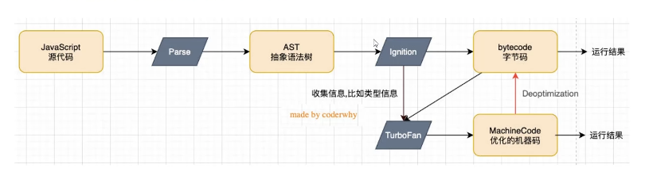

# 执行流程


## V8引擎定义

v8引擎是由c++编写的，使用c++实现了ESMA规范和WebAssembly，V8是可以独立运行的

所以js是高级语言，不能被底层机器直接处理，需要经过一系列的转化

### Parse

将源代码转换成抽象语法树（AST）

如果函数没有被调用的话，是不会被转换成AST的，这也是一个性能优化

### Ignation

将抽象语法树转换成字节码，字节码是跨平台的（运行在windows，或者macOs）

在不同平台，字节码转成成对应平台的二进制码，此时cpu可以直接执行

- 同时会收集TurboFan优化所需要的信息，比如函数参数类型信息，有了类型才能进行真实的运算
- 如果函数只执行一次，Ignation就会解释执行成字节码

```js
function sum(num1, num2) {
  return num1 + num2
}

sum(10, 20)
sum(20, 20)
sum(30, 20)
```
如果函数多次执行，每次都会对方法做这个转换，效率就很低

### TurboFan

性能优化，将字节码转换成cpu可以直接执行的机器码

- 如果一个函数被多次调用，那么就会标记成热点函数，然后就会经过TurboFan转换成优化的机器码，提高代码执行性能
- 机器码也会被还原成字节码，比如在函数执行的过程中，类型发生了变化，之前的机器码不能正确处理后续运算就会逆向转换成字节码


#### 那么可以把所有代码都转换成机器码吗

sum(10, 20) 但是传入参数sum('aaa', 'bbb')

这样转成的机器码就不一致，另外全部转成机器码会大大增加内存使用

所以在开发中最好不要使用和约定不一致的数据格式，这里ts在一定程度上就能提高我们的代码性能