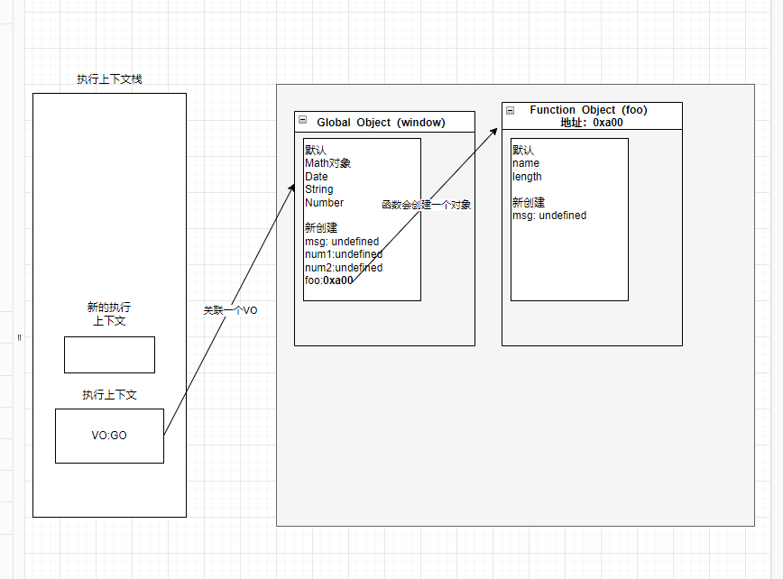
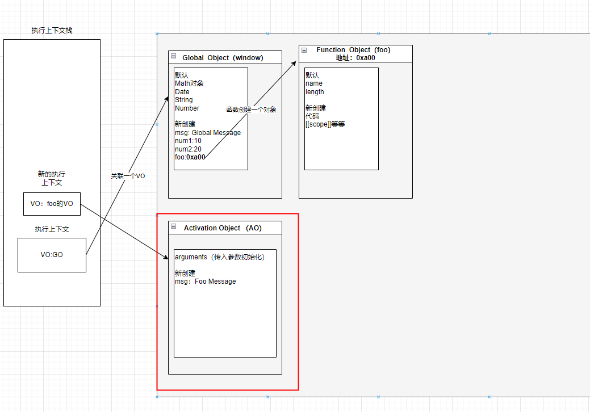
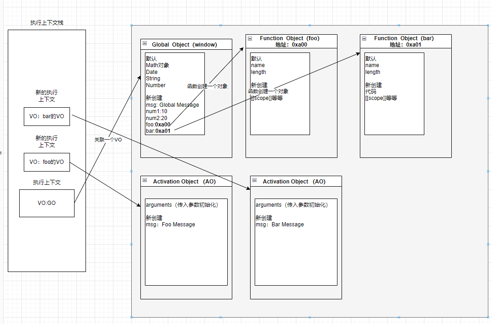

# 可以学到什么

- ECMAScript3中学到的是javascript执行原理，作用域，作用域链，闭包等等
- ECMAScript5中学习块级作用域，let，const等概念

版本在变，整体思路是一致的

## 比如下面的代码

```js
var msg = 'Global Message'

function foo () {
  var msg = 'Foo Message'
}

var num1 = 10
var num2 = 20
var result = num1 + num2

foo()

console.log(result)
```

## 执行上下文

js引擎内部有一个执行上下文栈，它是用于执行代码的调用栈

这个栈有什么作用呢，就是为了执行代码块的

- 全局的代码块为了执行会创建一个全局上下文
- 全局上下文会被放入到执行上下文栈中

执行上下文在被放入到栈中主要包含两部分内容
- 第一部分：在`代码执行前`，造parser转成AST的过程中，会将全局定义的变量，函数等加入到GlobalObject（GO）中，但是并不会赋值
 - 这个过程实际上就是变量的作用域提升
- 第二部分：在代码执行中，对变量进行赋值，或者执行其他的函数

`代码在运行的时候会不断往执行栈中添加执行上下文，比如上面的foo方法执行时就会产生foo的执行上下文，处于栈顶的执行上下文就是正在执行的代码环境`

## 认识vo对象



每一个执行上下文都会关联一个VO（Variable Object 变量对象），变量和函数声明都会被添加到这个vo对象中

但是当遇到函数声明时也会同时创建一个函数关联的VO（Function Object 方法对象）

如果声明了同名的变量或者函数

```js
function bar () {}
var bar

// 或者
var bar
function bar () {}
```

`此时在VO中函数声明总是晚生成的`，所以打印bar时都会打印函数

当全局代码被执行的时候，VO就是GO对象了，同时this也是GO对象

`这里注意所有的VO在转AST树的时候就已经创建好了`，创建完成之后才是真实的执行代码


## 执行代码

此时才会去给我们声明的变量赋值，这也是我们使用在声明之前的时候仍然能答应不报错的原因

## 执行函数

在执行过程中执行到函数时，就会更具函数体创建一个函数执行上下文，并压入到栈中

因为每个执行上下文都会关联一个VO，那么函数执行上下文关联的VO是什么呢

- 当进入一个函数执行上下文时，会创建一个AO对象
- 这个AO对象会使用arguments作为初始化，并且初始值就是传入的参数
- 这个AO对象会作为执行上下文的VO来存放变量的初始化



### 函数多次执行

`注意，函数的VO是在函数执行上下文在栈中运行的时候创建的，不是在函数对象创建的时候`

多次执行的时候，函数对象在堆内存中是一直存在的，但是执行上下文会不断的出栈入栈，AO也会不断的创建销毁

## 函数嵌套执行

如果函数代码没有执行完成，执行上下文就不会从栈中弹出，会继续往栈中压入新的执行上下文

```js
var msg = 'Global Message'

function bar () {
  var msg = 'Bar Message'
}

function foo () {
  var msg = 'Foo Message'
  bar()
}

var num1 = 10
var num2 = 20
var result = num1 + num2

foo()

console.log(result)
```


## 作用域和作用域链

```js
var message = 'Global Message'

function foo() {
  var message = 'Foo message'

  function bar() {
    var message = 'Bar message'
    console.log(message)
  }

  return bar
}

var bar = foo()
bar()
```

当进入到一个执行上下文时，执行上下文也会关联一个作用域链
- 作用域链是一个对象列表，用于变量标识符求值
- 当进入一个执行上下文时，这个作用域链被创建，并且更具代码类型，添加一系列的对象


### 作用域链如何形成

这个一定要注意，`作用域链在函数在创建的时候就决定了`，在进入执行上下文的时候，会把作用域链直接赋值给上下文中，作用域链不会包含自己的VO，但是查找的时候优先查找自己的VO

```js
var message = 'aaa'
function foo() {
  console.log(message)
}

let obj = {

  foo: function() {
    var message = 'bbb'
    // 此时的message仍然时aaa
    foo()
  }
}

obj.foo()
```


