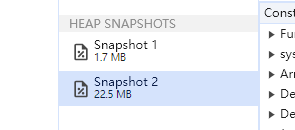

# 有了前面v8引擎执行原理，来看看闭包导致内存泄漏问题

先看看下面的例子

```js
function createIncrase() {
  const doms = new Array(100000).fill(0).map((_, i) => {
    const dom = document.createElement('div')
    dom.innerHTML = i;
    return dom
  })

  function increase() {
    doms.forEach(dom => {
      dom.innerHTML = Number(dom.innerHTML) + 1
    });
    return doms
  }

  return increase
}


let increase

const btn = document.querySelector('.btn')
function handleFn() {
  increase = createIncrase()
  increase()
}
btn.addEventListener('click', handleFn)

```

当我们执行到js click事件时
- 在调用createIncrase方法时，首先将createIncrase的执行上下文压入全局执行上下文中，此时会关联一个ao，包含doms属性和increase属性
- 接着创建一个increase函数，函数的作用于链就包含createIncrase的ao
- 接着返回到handleFn时会把increase函数的对象地址赋值给全局的increase
- 当垃圾回收触发时，由于全局的increase始终关联着createIncrase函数内部的increase函数，所以导致increase函数作用域链上的doms对象没法被回收

看看浏览器的执行效果


## 解决方式，执行完成之后把函数引用去掉

如果函数不再被使用，手动置为null

```js
function handleFn() {
  increase = createIncrase()
  increase()

  increase = null
}
```

## 另一种隐藏的内存泄漏
```js
function createIncrase() {
  const doms = new Array(100000).fill(0).map((_, i) => {
    const dom = document.createElement('div')
    dom.innerHTML = i;
    return dom
  })

  function increase() {
    
  }

  // function test () {
  //   doms
  // }

  return increase
}

let increase

const btn = document.querySelector('.btn')
function handleFn() {
  increase = createIncrase()
}
btn.addEventListener('click', handleFn)
```

如果在内存中定义了，但是没有用到的内存，js引擎在编译时会被优化掉，比如如果没有test函数时，doms一开始就不会存在内存中

但是当有test函数时使用了doms属性，doms就会存在于createIncrase的ao中，从而出现在increase的作用域链里，所以就会出现隐式的内存泄漏


## 总结
- 持有了不再需要的函数引用，会导致函数关联的词法环境无法销毁，从而导致内存泄漏
- 当多个函数共享词法环境时，会导致词法环境膨胀，从而导致出现无法触达的对象无法被回收


