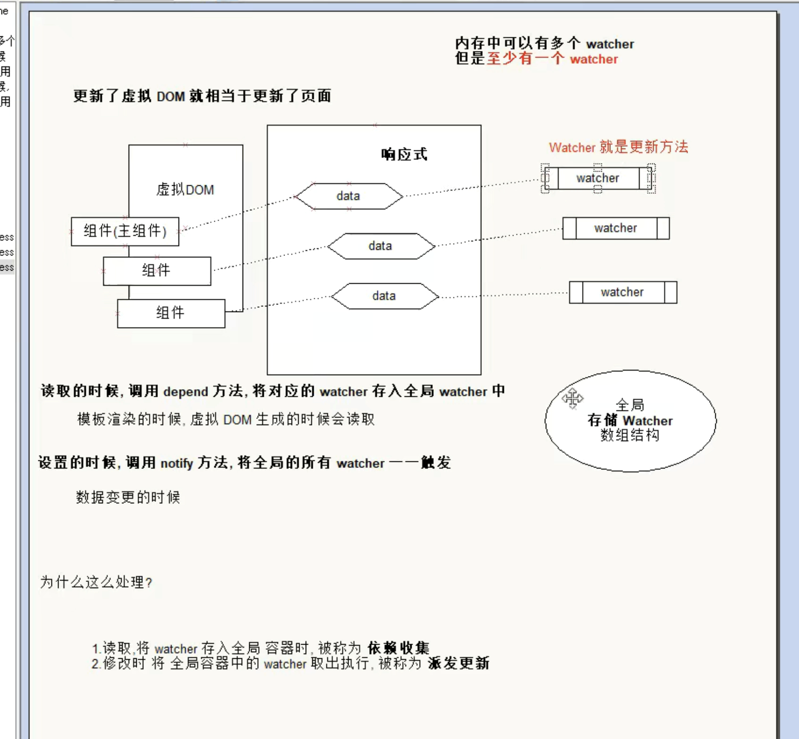

## 发布订阅模式

目标：为了解耦，让各个模块之间没有紧密联系
现在的处理办法是在属性变化的时候调用mountComponent方法，实际上更新的是全部的页面，这个在vue中肯定是不合理的，vue中都是局部更新的

在vue中，都是以组件为单位进行**判断**，以节点为单位进行更新的
- 如果代码中没有自定义组件，那么在比较算法的时候，我们会将全部的模板对应的虚拟dom进行比较
- 如果代码中有自定义组件，那么在比较算法的时候，我们会判断哪些组件的属性发生了变化，只会比较更新数据的组件，其他组件不会处理

复杂的页面都是有很多组件构成的，每一个属性的更新都需要调用mountComponent，显然是不太合理的

我们的目标是**如果修改了什么属性，就只修改这个属性对应的页面dom**

这样我们的mountComponent就一定不能写死

这里用到了发布订阅模式

举个例子：我们去超市买东西，要买好几个，但是这些货卖的很好，没货了，这个时候我们告诉老板，有货的时候打电话。

- 这里老板就是发布者
- 我们是订阅者
- 买的东西就是订阅的事件
- 打电话就是触发订阅

使用代码描述
- 老板提供一个账簿（数组）
- 我们订阅商品，老板会记录，谁记录了设呢商品（数组中存入，事件类型，事件）
- 等待
- 当货品到的时候，老板按照记录给我们打电话（遍历数组，取出数组的元素来使用）

实际上就是一个事件模型
- 有一个event事件
- on off emit 事件

来实现这个事件模型
- event是一个全局对象
- event.on('事件名', '处理函数')
  - 事件可以连续注册
- 移除事件 event.off
  - 移除所有
  - 移除某一个事件
  - 移除某一个事件下的摸个处理函数
- 写别的代码
- event.emit('事件名', 参数)，执行先前注册的方法

```js
var eventObjs = {}
var event = (function () {
    return {
        on: function (type, handler) {
            (eventObjs[type] || (eventObjs[type] = [])).push(handler)
        },
        off: function (type, handler) {
            if (arguments.length == 0) {
                eventObjs = {}
            } else if (arguments.length == 1) {
                eventObjs[type] = []
            } else if (arguments.length == 2) {
                let _events = eventObjs[type]
                if(!_events) return;
                for (let i = _events.length; i >= 0; i--) {
                    if (handler === _events[i]) {
                        _events.splice(i, 1)
                    }
                }
            }
        },
        // 包装参数
        emit: function (type) {
            let args = Array.prototype.slice.call(arguments, 1)
            let _events = eventObjs[type]
            if(!_events) return;
            for (let i = 0; i < _events.length; i++) {
                _events[i].apply(null, args)
            }
        }
    }
}())

// 注册事件
function f () {
    console.log(111)
}

function foo (a, b) {
    console.log(2222, a, b)
}
event.on('click', f)
event.on('click', f)
event.on('click', foo)
event.on('dbclick', f)
event.on('dbclick', foo)

console.log(111111)
console.log(111111)
console.log(111111)

event.emit('click', 'hahha')
```

#### vue模型



简而言之

先建立一个全局的watcher

当我们在读取的时候，调用depend方法，将对应的watcher存入全局watcher中
- 模板渲染的时候，虚拟dom生成的时候读取

设置的时候我们找到对应的watcher，触发
- 数据变更的时候


后面会讲到
- 我们把watcher存入全局watcher的过程叫做**依赖收集**
- 修改数据时，把watcher取出执行，我们叫做**派发更新**