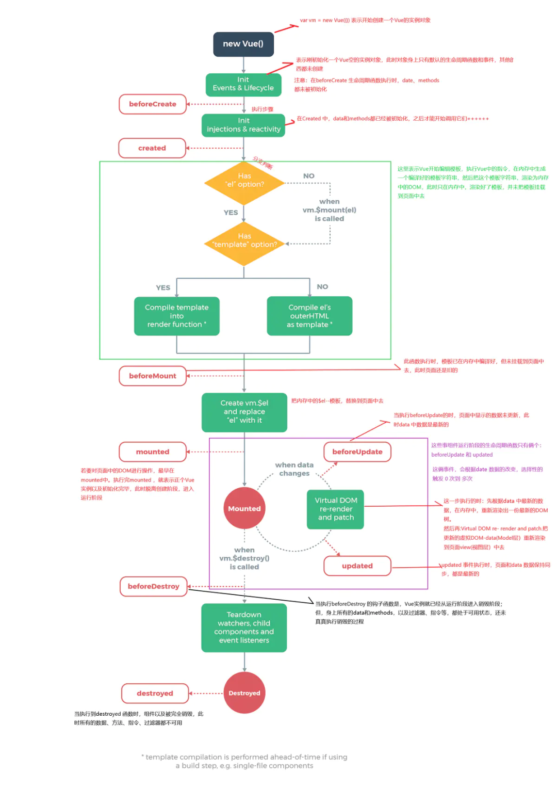

# vue生命周期

vue主要有以下生命周期

- beforeCreate 这个阶段只初始化了vue实例，创建了基本的生命周期和事件，其他东西都没创建。这个阶段data和methods都没被初始化

- created 这个阶段执行了injections和reactivity实现了数据的响应式，此时可以调用data和methods

- created -> beforeMounted 这个阶段检查是否有el属性和template，如果存在vue就开始编译模版，生成模版字符串，根据模版字符串在内存中生成dom字符串，这个时候只存在于内存中并没有挂在在真正的元素上

- beforeMounted 这个阶段还没有更新页面，只是在内存中生成了新的字符串

- beforeMounted -> mounted 这个阶段把内存中的dom字符串挂载到el上

- mounted 若要对页面中的dom元素操作，最早就在这个阶段，执行完mounted就代表初始化结束了，正式进入运行阶段

- beforeUpdate 这一步的时候数据时最新的，但是页面仍然是旧的

- beforeUpdate -> updated 这一步的时候就是dom-diff操作，先是根据新数据生成一个新的virtual dom，然后新旧virtual dom做比较，然后找出diff的部分更新到dom上去

- updated 这个事件执行时，数据和页面都是最新的了

- beforeDestroy 当执行到这一步的时候组件就要开始销毁了，但是此时组件上所有的data，methods，指令，等等都处于可用状态

- destroyed 这个阶段就是终止阶段，这个阶段组件上的属性就都不能用了，这个阶段可以把定时器和一些全局定义的变量删除掉，减少内存占用，可清理它与其它实例的连接，解绑它的全部指令及事件监听器

## 数据请求时放在created还是mounted

created的时候dom时还没有生成的，mounted阶段才会产生真实dom，created在触发时机上要比mounted早，放在mounted请求数据又可能造成页面闪动，因为此时dom已更新，最好的就是将数据变动放在created中
