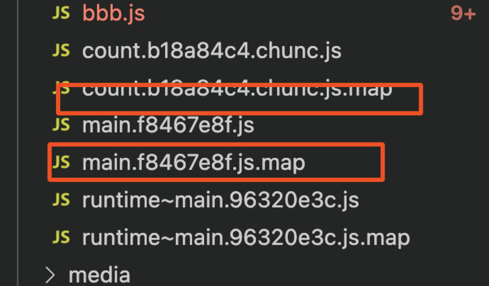
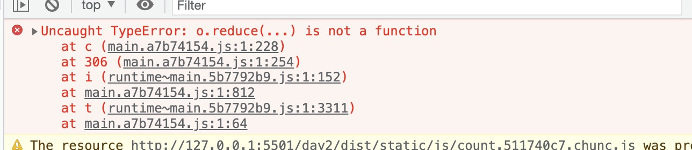
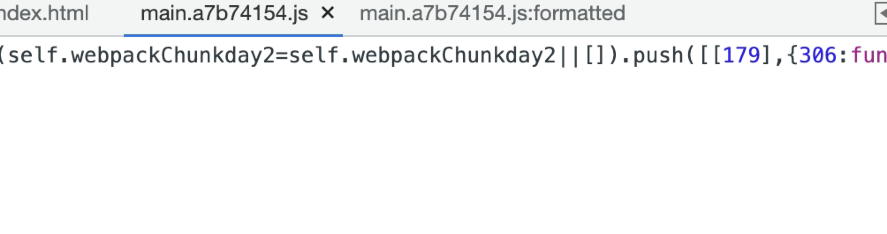
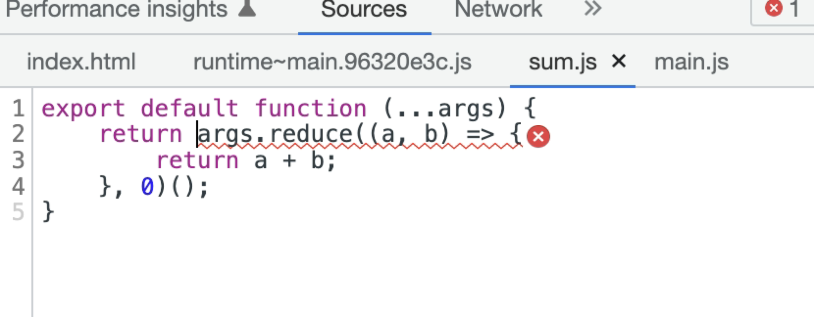
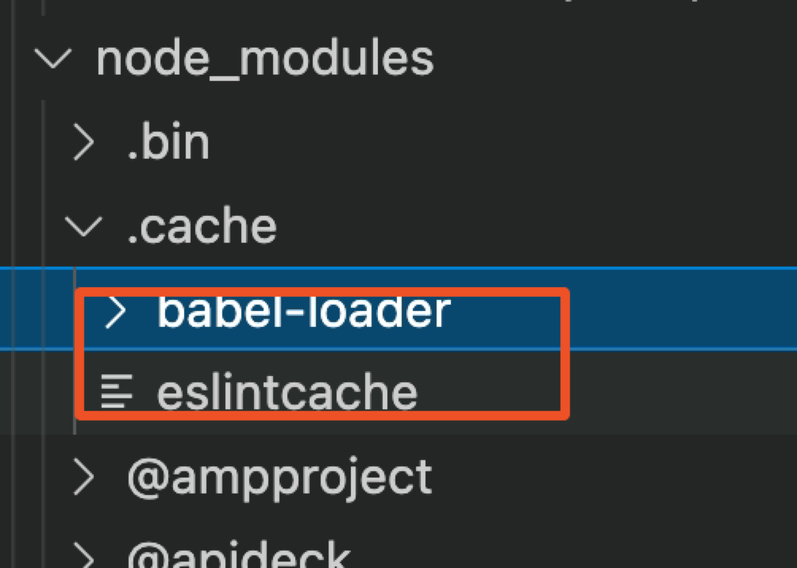

## 提升开发体验

### SourceMap
开发时我们运行的代码是经过 webpack 编译后的，进行过编译，混淆，压缩后，代码已经不可读了，css和js也混合在了一起，如果此时代码出错进行调试将是一件很麻烦的事情

sourceMap（源码映射）就是一个源代码与构建代码一一映射的方案

它会生成一个 xxx.map 文件，他会包含源代码和构建后代码，每一行每一列之间的映射关系，当构建后代码出错时，我们可以通过map文件找到源代码相应的位置

用法：
通过查看<a href="https://webpack.docschina.org/configuration/devtool/">Webpack DevTool</a> 文档可知，SourceMap 的值有很多种情况

实际开发中我们只用关注两种情况

开发模式：cheap-module-source-map
- 优点：打包编译速度快，只包含行映射
- 缺点：没有列映射
```js
module.exports = {
  // 其他省略
  mode: "development",
  devtool: "cheap-module-source-map",
};
```

生产模式：source-map
- 优点：包含行/列映射
- 缺点：打包编译速度更慢
```js
module.exports = {
  // 其他省略
  mode: "production",
  devtool: "source-map",
};
```

运行之后会生成下面这种文件










### 提升打包构建速度
#### HotModuleReplacement 热模块替换
开发时我们修改了其中一个模块代码，Webpack 默认会将所有模块全部重新打包编译，速度很慢。

当我们修改某个模块时，可以只更新那一个模块吗，其他模块不变，这样就能有更快的打包速度了

HotModuleReplacement（HMR/热模块替换）：在程序运行中，替换、添加或删除模块，而无需重新加载整个页面

使用

1、自动化中
```js
// 其他省略
  devServer: {
    host: "localhost", // 启动服务器域名
    port: "3000", // 启动服务器端口号
    open: true, // 是否自动打开浏览器
    hot: true, // 开启HMR功能（只能用于开发环境，生产环境不需要了）
  },
```
此时css 样式经过 style-loader 处理，已经具备 HMR 功能了。 但是 js 还不行

2、js配置
```js
if (module.hot) {
  module.hot.accept("./js/count.js", function (count) {
    const result1 = count(2, 1);
    console.log(result1);
  });
}
```
但是像上面这样写会很麻烦，所以实际开发我们会使用其他 loader 来解决。

比如：vue-loader, react-hot-loader。

#### OneOf
打包时每个文件都会经过所有 loader 处理，虽然因为 test 正则原因实际没有处理上，但是都要过一遍。比较慢。比如js文件也会把css的loader跑一边，我们要避免这种情况

使用：把我们的loader用OneOf包裹一下
```js
rules: [
            {
                oneOf: [loader1, loader2]
            }
        ]
```

#### Include/Exclude
开发时我们需要使用第三方的库或插件，所有文件都下载到 node_modules 中了。而这些文件是不需要编译可以直接使用的。

所以我们在对 js 文件处理时，要排除 node_modules 下面的文件。

loader和plugin中都能使用

```js
{
    test: /\.js$/,
    // exclude: /node_modules/, // 排除node_modules代码不编译
    include: path.resolve(__dirname, "../src"), // 也可以用包含
    loader: "babel-loader",
},
```

#### Cache
每次打包时 js 文件都要经过 Eslint 检查 和 Babel 编译，速度比较慢。

我们可以缓存之前的 Eslint 检查 和 Babel 编译结果，这样第二次打包时速度就会更快了。

babel编译缓存之后会在node_module/.cache中默认生成一个文件夹

eslint缓存我们可以指定一个目录



```js
{
    test: /\.js$/,
    // exclude: /node_modules/, // 排除node_modules代码不编译
    include: path.resolve(__dirname, "../src"), // 也可以用包含
    loader: "babel-loader",
    options: {
        cacheDirectory: true, // 开启babel编译缓存
        cacheCompression: false, // 开启缓存文件压缩，这个没必要，因为不会在我们上线使用，还会增加消耗，降低打包速度
    },
},

new ESLintWebpackPlugin({
    // 指定检查文件的根目录
    context: path.resolve(__dirname, "../src"),
    exclude: "node_modules", // 默认值
    cache: true, // 开启缓存
    // 缓存目录
    cacheLocation: path.resolve(
    __dirname,
    "../node_modules/.cache/.eslintcache"
    ),
}),
```

#### Thead
当项目越来越庞大时，打包速度越来越慢，甚至于需要一个下午才能打包出来代码。这个速度是比较慢的。

我们想要继续提升打包速度，其实就是要提升 js 的打包速度，因为其他文件处理都比较简单

而对 js 文件处理主要就是 eslint（校验）、babel（编译）、Terser（压缩） 三个工具，所以我们要提升它们的运行速度。

我们可以开启多进程同时处理 js 文件，这样速度就比之前的单进程打包更快了

**需要注意：请仅在特别耗时的操作中使用，因为每个进程启动就有大约为 600ms 左右开销**

因为loader和plugin都是不同人开发的，所以配置上会有区别

使用：
```js
// nodejs核心模块，直接使用
const os = require("os");
// cpu核数
const threads = os.cpus().length;
// loader配置中，thread-loader要写在babel-loader后面
{
    test: /\.js$/,
    // exclude: /node_modules/, // 排除node_modules代码不编译
    include: path.resolve(__dirname, "../src"), // 也可以用包含
    use: [
        {
        loader: "thread-loader", // 开启多进程
        options: {
            workers: threads, // 数量
        },
        },
        {
        loader: "babel-loader",
        options: {
            cacheDirectory: true, // 开启babel编译缓存
        },
        },
    ],
},

// plugin配置中，eslint， 增加threads配置
new ESLintWebpackPlugin({
    // 指定检查文件的根目录
    context: path.resolve(__dirname, '../src'),
    exclude: 'node_modules',
    cache: true, // 开启缓存
    cacheLocation: path.resolve(__dirname, '../node_modules/.cache/eslintcache/'),
    threads
}),

// js压缩中
optimization: {
    minimize: true,
    minimizer: {
        // 当生产模式会默认开启TerserPlugin，但是我们需要进行其他配置，就要重新写了
        new TerserPlugin({
            parallel: threads // 开启多进程
        }),
    ]
}
```
