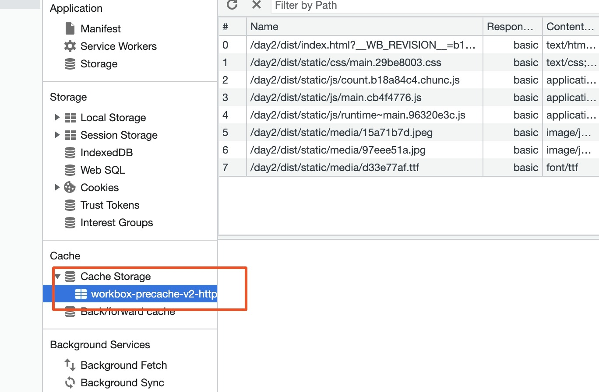

## 优化代码运行性能

### Code Split
打包代码时会将所有 js 文件打包到一个文件中，体积太大了，我们如果只要渲染首页，就应该只加载首页的 js 文件，其他文件不应该加载

所以我们需要将打包生成的文件进行代码分割，生成多个 js 文件，渲染哪个页面就只加载某个 js 文件，这样加载的资源就少，速度就更快

Code Split干了两件事
- 分割文件：将打包生成的文件进行分割，生成多个 js 文件。
- 按需加载：需要哪个文件就加载哪个文件。

使用

#### 1、多入口
```js
// 单入口
// entry: './src/main.js',
// 多入口
entry: {
    app: './src/app.js',
    main: './src/main.js',
},
```
比如我们有两个页面，一个app，一个main，如果我们所有js都输出到一个文件中，实际应用中肯定不合适

所以我们可以用如下配置，配置了几个入口，至少输出几个 js 文件，我们可以按页面加在我们需要的js
```js
// [name]是webpack命名规则，使用chunk的name作为输出的文件名。
// 什么是chunk？打包的资源就是chunk，输出出去叫bundle。
// chunk的name是啥呢？ 比如： entry中xxx: "./src/xxx.js", name就是xxx。注意是前面的xxx，和文件名无关。
// 为什么需要这样命名呢？如果还是之前写法main.js，那么打包生成两个js文件都会叫做main.js会发生覆盖。(实际上会直接报错的)
output: {
    chunkFilename: 'static/js/[name]_chunc.js'
},
```

#### 2、提取重复代码
如果多份代码使用了同一份代码，打包的时候就都会打包进去，我们可以把代码抽离出来

我们需要提取多入口的重复代码，只打包生成一个 js 文件，其他文件引用它就好。

```js
optimization: {
    // 代码分割配置
    splitChunks: {
      chunks: "all", // 对所有模块都进行分割
      // 以下是默认值
      // minSize: 20000, // 分割代码最小的大小
      // minRemainingSize: 0, // 类似于minSize，最后确保提取的文件大小不能为0
      // minChunks: 1, // 至少被引用的次数，满足条件才会代码分割
      // maxAsyncRequests: 30, // 按需加载时并行加载的文件的最大数量
      // maxInitialRequests: 30, // 入口js文件最大并行请求数量
      // enforceSizeThreshold: 50000, // 超过50kb一定会单独打包（此时会忽略minRemainingSize、maxAsyncRequests、maxInitialRequests）
      // cacheGroups: { // 组，哪些模块要打包到一个组
      //   defaultVendors: { // 组名
      //     test: /[\\/]node_modules[\\/]/, // 需要打包到一起的模块
      //     priority: -10, // 权重（越大越高）
      //     reuseExistingChunk: true, // 如果当前 chunk 包含已从主 bundle 中拆分出的模块，则它将被重用，而不是生成新的模块
      //   },
      //   default: { // 其他没有写的配置会使用上面的默认值
      //     minChunks: 2, // 这里的minChunks权重更大
      //     priority: -20,
      //     reuseExistingChunk: true,
      //   },
      // },
      // 修改配置
      cacheGroups: {
        // 组，哪些模块要打包到一个组
        // defaultVendors: { // 组名
        //   test: /[\\/]node_modules[\\/]/, // 需要打包到一起的模块
        //   priority: -10, // 权重（越大越高）
        //   reuseExistingChunk: true, // 如果当前 chunk 包含已从主 bundle 中拆分出的模块，则它将被重用，而不是生成新的模块
        // },
        default: {
          // 其他没有写的配置会使用上面的默认值
          minSize: 0, // 我们定义的文件体积太小了，所以要改打包的最小文件体积
          minChunks: 2,
          priority: -20,
          reuseExistingChunk: true,
        },
        },
    },
}
```

运行之后就会发现，代码把相同的引用文件已经抽离出来形成一个单独文件了

#### 3、按需加载，动态导入
我们在开发中会遇到下面这种情况
```js
document.getElementById("btn").onclick = function () {
  // 动态导入 --> 实现按需加载
  // 即使只被引用了一次，也会代码分割
  import("./math.js").then(({ sum }) => {
    alert(sum(1, 2, 3, 4, 5));
  });
};
```
经过上面的配置，我们可以发现 一旦通过 import 动态导入语法导入模块，模块就被代码分割，同时也能按需加载了

#### 4、给动态导入文件取名称
开发的时候发现，动态导入语法在eslint校验中会报错，需要我们下载插件解决
```js
npm i eslint-plugin-import -D
```
// .eslintrc.js
```js
module.exports = {
    plugins: ["import"]
}
```
给动态导入文件取名称
```js
document.getElementById("btn").onClick = function () {
    // eslint会对动态导入语法报错，需要修改eslint配置文件
    // webpackChunkName: "math"：这是webpack动态导入模块命名的方式
    // "math"将来就会作为[name]的值显示。
    import(/* webpackChunkName: "math" */ "./js/math.js").then(({ count }) => {
        console.log(count(2, 1));
    });
};
```

统一命名规则
```js
output: {
    path: path.resolve(__dirname, "../dist"), // 生产模式需要输出
    filename: "static/js/[name].js", // 入口文件打包输出资源命名方式
    chunkFilename: "static/js/[name].chunk.js", // 动态导入输出资源命名方式
    assetModuleFilename: "static/media/[name].[hash][ext]", // 图片、字体等资源命名方式（注意用hash）
    clean: true,
}
```

### Preload / Prefetch
我们前面已经做了代码分割，同时会使用 import 动态导入语法来进行代码按需加载（我们也叫懒加载，比如路由懒加载就是这样实现的）

但是加载速度还不够好，比如：是用户点击按钮时才加载这个资源的，如果资源体积很大，那么用户会感觉到明显卡顿效果

我们想在浏览器空闲时间，加载后续需要使用的资源。我们就需要用上 Preload 或 Prefetch 技术

介绍
- Preload：告诉浏览器立即加载资源
- Prefetch：告诉浏览器在空闲时才开始加载资源

共同点：
- 都只会加载资源，并不执行。
- 都有缓存。

区别
- Preload加载优先级高，Prefetch加载优先级低。
- Preload只能加载当前页面需要使用的资源，Prefetch可以加载当前页面资源，也可以加载下一个页面需要使用的资源。

使用场景
- 当前页面优先级高的资源用 Preload 加载。
- 下一个页面需要使用的资源用 Prefetch 加载。

Preload兼容性要比Prefetch好一些

使用
```js
// 下载包
npm i @vue/preload-webpack-plugin -D
```

```js
// 这是一个插件
const PreloadWebpackPlugin = require("@vue/preload-webpack-plugin");

plugins:[
    new PreloadWebpackPlugin({
      rel: "preload", // preload兼容性更好
      as: "script",
      // rel: 'prefetch' // prefetch兼容性更差
    }),
]
```

#### Network Cache

将来开发时我们对静态资源会使用缓存来优化，这样浏览器第二次请求资源就能读取缓存了，速度很快。

但是这样的话就会有一个问题, 因为前后输出的文件名是一样的，都叫 main.js，一旦将来发布新版本，因为文件名没有变化导致浏览器会直接读取缓存，不会加载新资源，项目也就没法更新了。

所以我们从文件名入手，确保更新前后文件名不一样，这样就可以做缓存了。

- fullhash（webpack4 是 hash）-> 每次修改任何一个文件，所有文件名的 hash 至都将改变。所以一旦修改了任何一个文件，整个项目的文件缓存都将失效。
- chunkhash -> 根据不同的入口文件(Entry)进行依赖文件解析、构建对应的 chunk，生成对应的哈希值。我们 js 和 css 是同一个引入，会共享一个 hash 值。
- contenthash -> 根据文件内容生成 hash 值，只有文件内容变化了，hash 值才会变化。所有文件 hash 值是独享且不同的。

用法

```js
// contenthash
output: {
    path: path.resolve(__dirname, "../dist"), // 生产模式需要输出
    // [contenthash:8]使用contenthash，取8位长度
    filename: "static/js/[name].[contenthash:8].js", // 入口文件打包输出资源命名方式
    chunkFilename: "static/js/[name].[contenthash:8].chunk.js", // 动态导入输出资源命名方式
    assetModuleFilename: "static/media/[name].[hash][ext]", // 图片、字体等资源命名方式（注意用hash）
    clean: true,
  },
```

这里引入了一个问题

当我们修改 math.js 文件再重新打包的时候，因为 contenthash 原因，math.js 文件 hash 值发生了变化（这是正常的）。

但是 main.js 文件的 hash 值也发生了变化，这会导致 main.js 的缓存失效。明明我们只修改 math.js, 为什么 main.js 也会变身变化呢

因为main.js引入了math.js，当math.js文件hash值变了后，main.js文件也就发生了变化，所以导致main.js也会更新

解决思路：

将 hash 值单独保管在一个 runtime 文件中

我们最终输出三个文件：main、math、runtime。当 math 文件发送变化，变化的是 math 和 runtime 文件，main 不变。

runtime 文件只保存文件的 hash 值和它们与文件关系，整个文件体积就比较小，所以变化重新请求的代价也小。

```js
// 提取runtime文件
runtimeChunk: {
    name: (entrypoint) => `runtime~${entrypoint.name}`, // runtime文件命名规则
},
```

### PWA
这个兼容性比较差，可以了解一下

开发 Web App 项目，项目一旦处于网络离线情况，就没法访问了。

我们希望给项目提供离线体验

介绍一下

渐进式网络应用程序(progressive web application - PWA)：是一种可以提供类似于 native app(原生应用程序) 体验的 Web App 的技术

其中最重要的是，在 离线(offline) 时应用程序能够继续运行功能。

内部通过 Service Workers 技术实现的

使用：

下载包
```js
npm i workbox-webpack-plugin -D
```
修改配置
```js
const WorkboxPlugin = require("workbox-webpack-plugin");
plugins:[
    new WorkboxPlugin.GenerateSW({
      // 这些选项帮助快速启用 ServiceWorkers
      // 不允许遗留任何“旧的” ServiceWorkers
      clientsClaim: true,
      skipWaiting: true,
    }),
]
```

修改入口文件
```js
if ("serviceWorker" in navigator) {
  window.addEventListener("load", () => {
    navigator.serviceWorker
      .register("/service-worker.js")
      .then((registration) => {
        console.log("SW registered: ", registration);
      })
      .catch((registrationError) => {
        console.log("SW registration failed: ", registrationError);
      });
  });
}
```

执行run build的时候会报错，因为路径问题

此时如果直接通过 VSCode 访问打包后页面，在浏览器控制台会发现 SW registration failed。

因为我们打开的访问路径是：http://127.0.0.1:5500/dist/index.html。此时页面会去请求 service-worker.js 文件，请求路径是：http://127.0.0.1:5500/service-worker.js，这样找不到会 404。

实际 service-worker.js 文件路径是：http://127.0.0.1:5500/dist/service-worker.js。

解决办法：使用serve，serve 也是用来启动开发服务器来部署代码查看效果的。

下载包：
```js
npm i serve -g
```
运行指令
```js
serve dist
```

运行之后会出现，此时我们可以把网断掉试试，页面功能仍然正常，当然请求接口肯定是不行的

