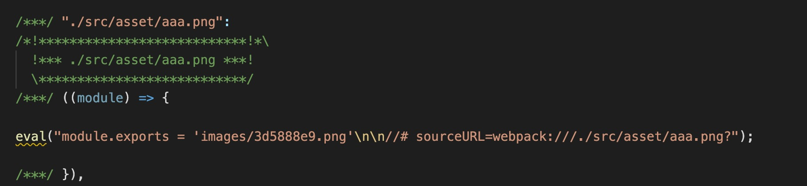

## 10手写loader babelLoader fileLoader

### babelLoader
作用：编译 js 代码，将 ES6+语法编译成 ES5-语法。

这里我们需要下载babel的一些依赖

babel的一些学习可以看官方网站<a href="https://www.babeljs.cn/docs/">Bable</a>

下载依赖：
```js
npm i @babel/core @babel/preset-env -D
```
使用
```js
const schema = require("./schema.json");
const babel = require("@babel/core");

// babel 是异步返回的，所以要用异步loader
module.exports = function (content) {
  const options = this.getOptions(schema);
  // 使用异步loader
  const callback = this.async();
  // 使用babel对js代码进行编译
  babel.transform(content, options, function (err, result) {
    callback(err, result.code);
  });
};
```

### file-loader
作用：是将文件原封不动的传出去，文件处理，需要用到buffer数据流，所以使用raw loader

我们看node_modules中的file-loader处理过后，会将图片，字体这些文件，处理成下面这种格式

eval("module.exports = 'images/3d5888e9.png'\n\n//# sourceURL=webpack:///./src/asset/aaa.png?");


我们要做的是，把文件重新生成，获取链接，链接上面拼上hash值，并用module.exports导出去

做法

下载包
```js
npm i loader-utils -D
```

实现
```js
const loaderUtils = require('loader-utils');

// 处理图片字体，都是buffer数据
// 所以需要使用到raw-loader

module.exports = function (content) {
    // 1、根据文件内容输出带hash值的文件名
    // 2、将文件输出出去
    // 3、返回 module.exports = '文件路径/文件名'

    let interpolateName = loaderUtils.interpolateName(
        this,
        "[hash:8].[ext][query]",
        { content}
    );
    
    console.log(interpolateName);
    interpolateName = `images/${interpolateName}`

    this.emitFile(interpolateName, content);
    return `module.exports = '${interpolateName}'`;
};

module.exports.raw = true;
```
loaderUtils可以参考github <a href="https://github.com/webpack/loader-utils">loader-utils</a>

loaderUtils.interpolateName 获取带hash值得文件名

this.emitFile可以生成文件

laoder配置

我们会发现图片总会生成两次，这是因为webpack会有一些默认的内置json导入
当我们在自定义 loader 加载一个 .json 文件时，要把type置为 "javascript/auto"，以绕过 webpack 内置的 json 导入
```js
{
  test: /\.(png|jpe?g|gif)$/,
  loader: "./loaders/file-loader.js",
  type: "javascript/auto", // 解决图片重复打包问题
},
```