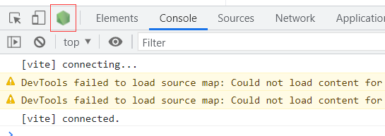

## plugin 原理
通过插件我们可以扩展 webpack，加入自定义的构建行为，使 webpack 可以执行更广泛的任务，拥有更强的构建能力。

工作原理
> webpack 就像一条生产线，要经过一系列处理流程后才能将源文件转换成输出结果。 这条生产线上的每个处理流程的职责都是单一的，多个流程之间有存在依赖关系，只有完成当前处理后才能交给下一个流程去处理。
> 
>  插件就像是一个插入到生产线中的一个功能，在特定的时机对生产线上的资源做处理。webpack 通过 Tapable 来组织这条复杂的生产线。 webpack 在运行过程中会广播事件，插件只需要监听它所关心的事件，就能加入到这条生产线中，去改变生产线的运作。 webpack 的事件流机制保证了插件的有序性，使得整个系统扩展性很好。 ——「深入浅出 Webpack」

站在代码逻辑的角度就是：webpack 在编译代码过程中，会触发一系列 Tapable 钩子事件，插件所做的，就是找到相应的钩子，往上面挂上自己的任务，也就是注册事件，这样，当 webpack 构建的时候，插件注册的事件就会随着钩子的触发而执行了

### webpack 内部的钩子
这是hook的类型，并不是说有这些分类，具体的hook下面会讲到
```js
// 同步执行的钩子，不能处理异步任务
exports.SyncHook = require("./SyncHook");
// 同步执行的钩子，返回非空时，阻止向下执行
exports.SyncBailHook = require("./SyncBailHook");
// 同步执行的钩子，支持将返回值透传到下一个钩子中
exports.SyncWaterfallHook = require("./SyncWaterfallHook");
// 同步执行的钩子，支持将返回值透传到下一个钩子中，返回非空时，重复执行
exports.SyncLoopHook = require("./SyncLoopHook");
// 异步并行的钩子
exports.AsyncParallelHook = require("./AsyncParallelHook");
// 异步并行的钩子，返回非空时，阻止向下执行，直接执行回调
exports.AsyncParallelBailHook = require("./AsyncParallelBailHook");
// 异步串行的钩子
exports.AsyncSeriesHook = require("./AsyncSeriesHook");
// 异步串行的钩子，返回非空时，阻止向下执行，直接执行回调
exports.AsyncSeriesBailHook = require("./AsyncSeriesBailHook");
// 支持异步串行 && 并行的钩子，返回非空时，重复执行
exports.AsyncSeriesLoopHook = require("./AsyncSeriesLoopHook");
// 异步串行的钩子，下一步依赖上一步返回的值
exports.AsyncSeriesWaterfallHook = require("./AsyncSeriesWaterfallHook");
```
Tapable 还统一暴露了三个方法给插件，用于注入不同类型的自定义构建行为：

- tap：可以注册同步钩子和异步钩子。
- tapAsync：回调方式注册异步钩子。
- tapPromise：Promise 方式注册异步钩子。

### Plugin 构建对象
#### Compiler

compiler 对象中保存着完整的 Webpack 环境配置，每次启动 webpack 构建时它都是一个独一无二，仅仅会创建一次的对象。

这个对象会在首次启动 Webpack 时创建，我们可以通过 compiler 对象上访问到 Webapck 的主环境配置，比如 loader 、 plugin 等等配置信息。

它有以下主要属性：
- compiler.options 可以访问本次启动 webpack 时候所有的配置文件，包括但不限于 loaders 、 entry 、 output 、 plugin 等等完整配置信息。
- compiler.inputFileSystem 和 compiler.outputFileSystem 可以进行文件操作，相当于 Nodejs 中 fs。
- compiler.hooks 可以注册 tapable 的不同种类 Hook，从而可以在 compiler 生命周期中植入不同的逻辑。

具体hook可以见下面这个文档：<a href="https://webpack.docschina.org/api/compiler-hooks/">compiler hooks 文档</a>

#### Compilation
compilation 对象代表一次资源的构建，compilation 实例能够访问所有的模块和它们的依赖。

一个 compilation 对象会对构建依赖图中所有模块，进行编译。 在编译阶段，模块会被加载(load)、封存(seal)、优化(optimize)、 分块(chunk)、哈希(hash)和重新创建(restore)。

它有以下主要属性：
- compilation.modules 可以访问所有模块，打包的每一个文件都是一个模块。
- compilation.chunks chunk 即是多个 modules 组成而来的一个代码块。入口文件引入的资源组成一个 chunk，通过代码分割的模块又是另外的 chunk。
- compilation.assets 可以访问本次打包生成所有文件的结果。
- compilation.hooks 可以注册 tapable 的不同种类 Hook，用于在 compilation 编译模块阶段进行逻辑添加以及修改。

具体hook可以见下面这个文档：<a href="https://webpack.docschina.org/api/compilation-hooks/">compilation hooks 文档</a>

参考view，webpack打包过程也会有生命周期


### 开发一个简单插件
插件的构造和loader不一样

1、插件是使用class的方式创建的

2、插件中使用constructor接收配置中传递进来的参数

3、插件中使用apply方法来注册hook

4、compiler hook使用

compiler.hooks.myhook.tap('MyPlugin', (compilation) => {})

myhook可以按照官方文档使用，根据myhook的类型选用（tap, tapAsync, tapPromise）

tap方法的参数中，第一个参数可以随意命名，第二个参数就是compilation，我们可以在里面定义compilation的钩子

5、compilation hook

compilation.hooks.myhook.tap('TestPlugin', () => {});

同compiler hook差不多，都要参考官方文档，参数也根据官方文档使用

```js
/**
 * 1. webpack读取配置时，new TestPlugin() ，会执行插件 constructor 方法
 * 2. webpack创建 compiler 对象
 * 3. 遍历所有插件，调用插件的 apply 方法
 */

class TestPlugin {
    constructor () {
        console.log('TestPlugin constructor');
    }

    apply (compiler) {
        console.log('TestPlugin apply', compiler.options.mode);

        // 由文档可知environment是同步钩子，我们得使用tap
        // 第一个参数为事件名称，在 Webpack 中一般用于存储事件对应的插件名称（名字随意，只是起到注释作用）
        compiler.hooks.environment.tap('TestPlugin', (params) => {
            console.log('TestPlugin environment', params);
        });

        // 由文档可知emit是AsyncSeriesHook异步串行钩子，tap，tapPromise, tapAsync都可以使用
        // 不管延迟时间都是串行执行
        compiler.hooks.emit.tap('TestPlugin', (compilation) => {
            console.log('TestPlugin emit 111');
        });

        compiler.hooks.emit.tapAsync('TestPlugin', (compilation, callback) => {
            setTimeout(() => {
                console.log('TestPlugin emit 222');
                callback();
            }, 2000);
        });

        compiler.hooks.emit.tapPromise('TestPlugin', (compilation) => {
            return new Promise((resolve) => {
                setTimeout(() => {
                    console.log('TestPlugin emit 333');
                    resolve();
                }, 1000);
            });
        });

        // 由文档可知make是AsyncParallelHook异步并行钩子，tap，tapPromise, tapAsync都可以使用
        // 一进插件就同时执行，谁先到时间谁先执行
        // 并且执行完后才执行其他操作
        compiler.hooks.make.tapAsync('TestPlugin', (compilation, callback) => {
            setTimeout(() => {
                console.log('TestPlugin make 111');
                // 需要至少在make生命周期前完成注册
                compilation.hooks.seal.tap('TestPlugin', () => {
                    console.log('TestPlugin compilation seal 111');
                });
                callback();
            }, 2000);
        });
        compiler.hooks.make.tapAsync('TestPlugin', (compilation, callback) => {
            setTimeout(() => {
                console.log('TestPlugin make 222');
                callback();
            }, 1000);
        });
        compiler.hooks.make.tapAsync('TestPlugin', (compilation, callback) => {
            setTimeout(() => {
                console.log('TestPlugin make 333');
                callback();
            }, 3000);
        });


    }


}

module.exports = TestPlugin;
```

### 启动调试
我们在开发的时候肯定会遇到调试问题，比如我们想查看compiler，compilation，如果我们在控制台打印，会发现打印出来的数据超级庞大，控制台都展示不下，根本无法解析

我们可以在package.json中配置调试命令

```js
"scripts": {
    "debug": "node --inspect-brk ./node_modules/webpack-cli/bin/cli.js"
},
```

运行指令：npm run debug

这时候我们可以随意打开一个chrome页面，然后在控制台中可以看到下面这个图标，点击就会跳转一个新的页面，进入调试模式


这个时候在需要调试代码处用 debugger 打断点，代码就会停止运行，从而调试查看数据情况，每次修改代码的时候都需要重新执行一遍npm run bug