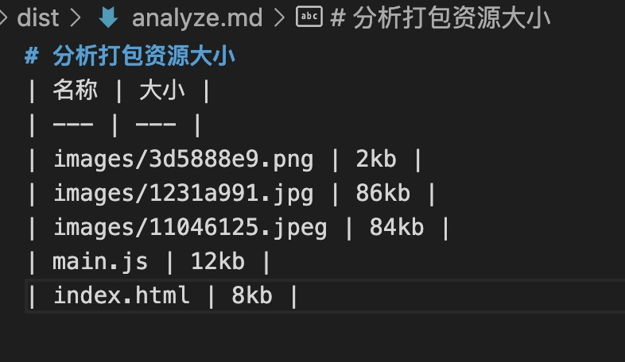

## AnalyzeWebpackPlugin

**作用：**

分析 webpack 打包资源大小，然后输出markdown文件，并输出分析文件。后面我们可以根据资源大小合理拆分文件

**思路：**
- 应该在emit阶段处理
- 首先 在compilation上 获取文件名，文件大小
- compilation.assets[xxx] 输出文件

```js
class AnalyzeWebpackPlugin {
    apply (compiler) {
        // emit 是异步钩子
        compiler.hooks.emit.tapPromise('AnalyzeWebpackPlugin', (compilation) => {
            return new Promise(resolve => {
                // 先转换为二维数组，因为我们需要文件名和文件内容
                const assets = Object.entries(compilation.assets);
                let source = "# 分析打包资源大小 \n| 名称 | 大小 |\n| --- | --- |";
                assets.forEach(([filename, filecontent]) => {
                    source += `\n| ${filename} | ${Math.ceil(filecontent.size()/1000)}kb |`;
                });

                // 文件内容生成，使用compilation.assets输出
                compilation.assets['analyze.md'] = {
                    source() {
                        return source;
                    },
                    size() {
                        return source.length;
                    }
                };
                resolve();
            });
        });
    }

}

module.exports = AnalyzeWebpackPlugin;
```

执行之后，我们可以看到在dist根目录下生成了一个analyze.md文件


