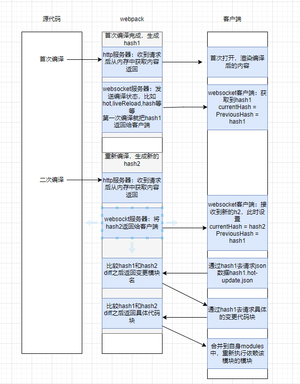
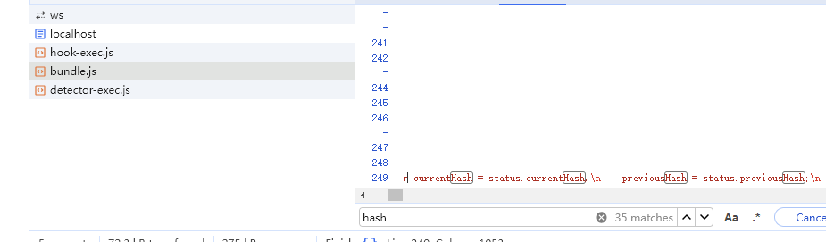
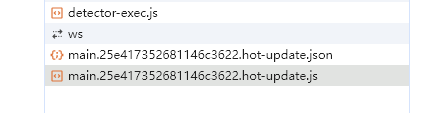
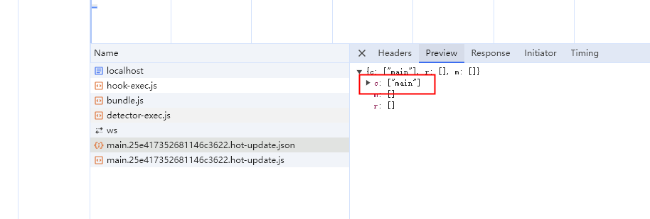
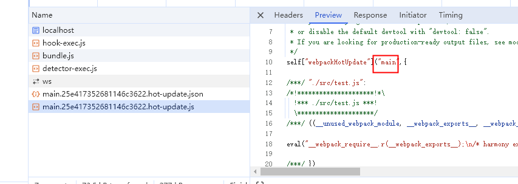

# webpack热更新

这个其实是前端面试中经常会问到的问题，今天就认真分析一下

## 热更新有什么用

想象一下如果我们每次修改都会触发页面刷新会有什么问题

- 管理后台，很多表单，当页面刷新时表单内容就会消失，需要重新填写
- 当前页面如果有各个阶段，比如答题答了一半，刷新之后需要重新开始

每次一个很小的改动都会造成页面刷新，整体开发效率偏低

## 首先搭建一个简单的webpack

```js
npm init
npm i -D webpack webpack-cli webpack-dev-server html-webpack-plugin
```
- webpack：这个不必说，核心库
- webpack-cli：主要用来处理命令行中的参数，并启动 webpack 编译
- webpack-dev-server：提供开发服务器，用来支持热更新
- html-webpack-plugin：用于将打包后的 css、js 等代码插入到 html 模版中

启动热更新功能

- 设置devServer.hot 为true
- 在代码中调用module.hot.accept

`注意我们这里没有使用框架，需要手动调用module.hot.accept才能实现热更新`，框架中提供了各种loader实现了HMR，这些都是比较成熟的解决方案了，比如
- Vue的vue-loader，支持组件的HMR
- React的react-refresh。实现了react组件的HMR

## 实际使用

webpack.config.js

```js
const path = require('path')
const HtmlWebpackPlugin = require("html-webpack-plugin");

module.exports = {
  entry: './src/index.js',
  module: {
    rules: [
      {
        test: /\.js$/,
        exclude: /node_module/,
        use: {
          loader: 'babel-loader'
        }
      }
    ]
  },
  output: {
    filename: 'bundle.js',
    path: path.resolve(__dirname, 'dist')
  },
  plugins: [
    new HtmlWebpackPlugin({
      template: path.resolve(__dirname, 'public/index.html')
    })
  ],
  mode: "development",
  devServer: {
    hot: true
  }
  
}
```

package.json

```js
"scripts": {
    "start": "webpack serve"
  },
```

index.js
```js
import { name } from './test'

// console.log(name)


const render = () => {
  let div = document.createElement('div')
  div.innerHTML = name

  document.body.appendChild(div)
}

if(module.hot) {
  module.hot.accept('./test', function() {
    render()
  })
}

```

test.js
```js
const name = 'dddd'

export {
  name
}
```

使用npm run start之后，页面就能打开了，webpack-cli会使用webpack-dev-serve的watch模式来帮我们启动编译

测试的时候你会发现，`当改变index.js时，浏览器仍然会刷新，当改变test.js时，浏览器不刷新就自动更新了`

## 核心思想

当我们运行webpack serve后，webpack-dev-server会往客户端添加两个文件

- websocket相关代码，用来跟websocket服务器进行通信
- 客户端接收到最新代码后进行更新

接着会帮我们启动两个服务

- 本地http服务：这个服务会给我们提供编译后的结果，浏览器通过接口请求时，会请求本地服务中编译之后的内容
- websocket服务：如果有新的模块发生变化，编译成功后会以消息的方式通知客户东，让客户端请求最新代码，并在客户端更新

此时会以watch模式开始编译，每次编译结束后都会产生一个新的hash值

> watch模式：使用watch模式启动webpack编译，文件系统中任何一个文件发生修改，webpack监听到变化后都会更具配置文件对模块进行重新编译打包，每次编译都会产生一个唯一的hash值

接着有了理论基础，我们看看热更新是如何实现的



### 首次编译



当第一次编译完成后，webpack内部会生成一个hash，比如是hash1，然后websocket服务器也会发送一个hash到客户端，第一次的时候也是hash1（其实发送的是当前hash）

客户端上就保存了两个变量
- currentHash 当前的hash值
- previousHash 上一次的hash值

初次编译时 currentHash = previousHash = hash1


### 二次编译

请求顺序





重新编译时，首先会生成一个新的hash，比如是hash2。然后使用websocket向客户端发送这个hash，当客户端接收到新的hash2时就会去比较老的hash1，然后重新设置

- currentHash = hash2
- previousHash = hash1

然后通过hash1去请求json数据，获取变更的代码块

服务端比较hash1和hash2，返回变更的代码块，比如：main

客户端接收到变更内容后，就会使用hash1继续去请求变更的代码块

服务端返回之后就可以合并到自身的modules中，然后执行依赖该模块的模块


